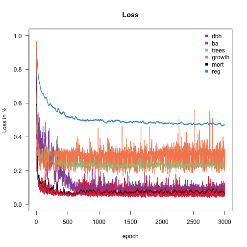
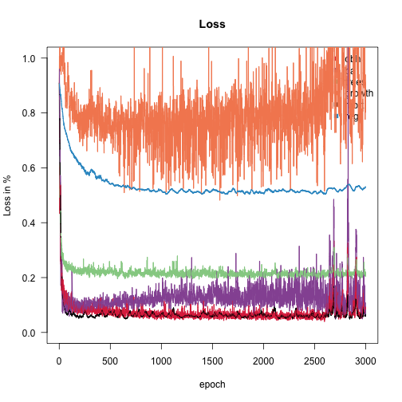

# Fitting FINN to forest inventory data (Oregon, US FIA)

Dynamic forest models are usually hand-calibrated. Here we calibrate
FINN directly from data: a subset of the US Forest Inventory & Analysis
(FIA) program for Oregon, prepared exactly as in the **Preparing your
data for FINN** vignette.

Everything on this page really runs — the two models are trained,
simulated and interpreted for real. Because that needs a torch backend
and a few minutes, the vignette is **precompiled**: `vignettes/build.R`
knits `fit-to-fia.Rmd.orig` once on a developer machine and commits the
resulting static `.Rmd`. So the code you see is exactly the code that
produced the output beside it, and the package builds anywhere without
torch.

``` r

library(FINN)
library(torch)
library(data.table)
library(ggplot2)
```

## The data

These four bundled tables are built by **`dev/make_extdata.R`**, which
subsamples the full Oregon FIA set in `data-raw/` down to ~40 sites. The
**climate** (`fia_env_dt.csv`) traces upstream to the FINN-fia analysis
repo (`scripts/03_attach_environment.R` → `07_prepare_finn_inputs.R`);
see `data-raw/README.md` for the full chain.

``` r

ext <- function(f) system.file("extdata", f, package = "FINN")
obs_dt     <- fread(ext("fia_obs_dt.csv"))     # observations, wide (one column per variable)
env_dt     <- fread(ext("fia_env_dt.csv"))     # RAW, untransformed climate
init_trees <- fread(ext("fia_init_trees.csv"))
species_dt <- fread(ext("fia_species_dt.csv"))

# a long form of the observations, so later we can match FINN's long predictions
# (sim$long$site) with a single merge()
resp     <- c("dbh", "ba", "trees", "growth", "mort", "reg")
obs_long <- melt(obs_dt, id.vars = c("siteID", "year", "species", "species_name"),
                 measure.vars = resp, variable.name = "variable", value.name = "obs")

cat(sprintf("%d sites, %d species, observation years %s\n",
            uniqueN(obs_dt$siteID), uniqueN(obs_dt$species),
            paste(sort(unique(obs_dt$year)), collapse = " & ")))
#> 40 sites, 11 species, observation years 1 & 2
species_dt
#>     species            species_name
#>       <int>                  <char>
#>  1:       1   Pseudotsuga menziesii
#>  2:       2          Pinus contorta
#>  3:       3          Abies concolor
#>  4:       4         Pinus ponderosa
#>  5:       5           Abies grandis
#>  6:       6             Alnus rubra
#>  7:       7       Tsuga mertensiana
#>  8:       8       Arbutus menziesii
#>  9:       9       Picea engelmannii
#> 10:      10 Lithocarpus densiflorus
#> 11:      11                   other
```

The environment is supplied in **natural units**: with
`env_autoscale = TRUE` (the default) FINN z-standardizes the predictors
internally and reuses the same constants at prediction time, so raw
values are all we ever pass.

``` r

ggplot(melt(env_dt[, c("temp", "prec")], measure.vars = c("temp", "prec")),
       aes(value)) +
  geom_histogram(bins = 20, fill = "grey40") +
  facet_wrap(~variable, scales = "free", labeller = as_labeller(
    c(temp = "Mean~annual~temp~(degree*C)", prec = "Annual~precip~(mm)"), label_parsed)) +
  labs(x = NULL, y = "site x year") + theme_minimal()
```


A few observed series — basal area and tree numbers by year for the most
abundant species:

``` r

top_sp <- obs_dt[species_name != "other", .(tot = sum(ba, na.rm = TRUE)), by = species][order(-tot)][1:4, species]
ggplot(obs_long[species %in% top_sp & variable %in% c("ba", "trees")],
       aes(factor(year), obs, fill = factor(species_name))) +
  geom_boxplot(outlier.size = 0.4) +
  facet_wrap(~variable, scales = "free_y") +
  scale_fill_viridis_d(name = "species") +
  labs(x = "observation year", y = NULL) + theme_minimal()
```


## Initial cohorts

``` r

init_cohorts <- makeInitCohorts(init_trees, Nspecies = max(obs_dt$species))
```

## Fit a Process-FINN

In the fully mechanistic configuration every process keeps its
predefined form, while its species and environmental parameters are
learned (`optimize* = TRUE`) and the `~.` formula lets every
environmental predictor enter the growth, regeneration and mortality
responses. The model is calibrated end-to-end by gradient descent
through the entire simulation.

``` r

FINN.seed(42)
m <- finn(
  N_species            = uniqueN(obs_dt$species),
  recruits_dbh         = 12.9,
  competition_process  = createProcess(~0, FINN::competition,  optimizeSpecies = TRUE),
  growth_process       = createProcess(~., FINN::growth,       optimizeSpecies = TRUE, optimizeEnv = TRUE),
  regeneration_process = createProcess(~., FINN::regeneration, optimizeSpecies = TRUE, optimizeEnv = TRUE),
  mortality_process    = createProcess(~., FINN::mortality,    optimizeSpecies = TRUE, optimizeEnv = TRUE)
)
```

``` r

fit(m,
  env         = env_dt,      # raw climate
  data        = obs_dt,
  init_cohort = init_cohorts,
  device      = "cpu",
  epochs      = 3000L,
  batchsize   = 40L,
  patches     = 4,
  patch_size  = 0.06,
  weights     = c(0.1, 10, 1.0, 10.0, 1, 1),
  lr          = 0.01,
  env_autoscale   = TRUE         # default
)
```



## Replace growth with a neural network (Hybrid-FINN)

FINN’s defining feature is that **any single demographic process can be
swapped from a mechanistic function to a neural network**, while the
others stay mechanistic — a *hybrid* model. The mechanistic processes
keep the system ecologically constrained; the network absorbs structure
the fixed functional form cannot express. Here we replace **growth**
with a small neural network via
[`createHybrid()`](https://finnverse.github.io/FINN/reference/createHybrid.md),
leaving competition, regeneration and mortality mechanistic, and refit
on the same data with the **identical
[`fit()`](https://finnverse.github.io/FINN/reference/fit.md) call**.

``` r

FINN.seed(42)
m_hybrid <- finn(
  N_species            = uniqueN(obs_dt$species),
  recruits_dbh         = 12.9,
  competition_process  = createProcess(~0, FINN::competition,  optimizeSpecies = TRUE),
  growth_process       = createHybrid(~., hidden = c(20L, 20L), transformer = FALSE),  # NN replaces growth
  regeneration_process = createProcess(~., FINN::regeneration, optimizeSpecies = TRUE, optimizeEnv = TRUE),
  mortality_process    = createProcess(~., FINN::mortality,    optimizeSpecies = TRUE, optimizeEnv = TRUE)
)
```

``` r

fit(m_hybrid,
  env = env_dt, data = obs_dt, init_cohort = init_cohorts, device = "cpu",
  epochs = 3000L, batchsize = 40L, patches = 4, patch_size = 0.06,
  weights = c(0.1, 10, 1.0, 10.0, 1, 1), lr = 0.01, env_autoscale = TRUE
)
```



With both variants fitted, the rest of the vignette inspects and
compares them: training convergence, a
[`summary()`](https://rspatial.github.io/terra/reference/summary.html)
of the learned structure, predicted-vs-observed fit, the learned niches,
and the accumulated local effects that reveal what the network learned.

## Training convergence

Both variants are trained the same way; the training loss of the process
model is shown here.

``` r

loss <- data.table(epoch = seq_along(m$history), loss = sapply(m$history, sum))
ggplot(loss, aes(epoch, loss)) +
  geom_line(colour = "steelblue") +
  scale_y_log10() +
  labs(x = "epoch", y = "total training loss (log scale)") + theme_minimal()
```


## What the model learned — `summary()`

[`summary()`](https://rspatial.github.io/terra/reference/summary.html)
gives a compact overview of the *learned structure*: for each process
and species it reports how important each environmental predictor is
(ALE-variance importance, rate-normalised) and its average conditional
effect. It reuses the cached conditional effects, so once
[`ALE()`](https://finnverse.github.io/FINN/reference/ALE.md) (below) or
a previous
[`summary()`](https://rspatial.github.io/terra/reference/summary.html)
has run it needs no further simulation.

``` r
summary(m)
FINN model summary
==================

### GROWTH

Analytical ALE importance (rate-normalised) (species in columns):
  variable    sp1     sp2      sp3      sp4     sp5    sp6     sp7     sp8
   tempmin 0.4044 18.6261 0.743434  2.18656 57.7642  0.831 0.90627  1.6865
      prec 7.1751  0.0587 0.104220 16.77873  8.2326 21.075 1.97203  0.0176
  precseas 0.4239  0.0936 0.067566  0.05002  0.7255  0.190 7.71865 27.0653
 precwarmq 5.8811  2.0147 0.823782  8.47265  1.0840 11.749 0.30062  0.1141
      temp 1.6235  4.8445 1.540920  0.00211  0.5391  0.103 0.25495  7.1976
   tempmax 0.0138  1.1516 0.000398  0.20759  0.0158  0.197 0.00647  0.4446
      sp9    sp10     sp11
 0.000221 0.24107 1.853373
 0.092211 0.10477 1.336186
 0.767364 0.00185 0.000305
 0.011779 1.87228 0.000268
 0.021319 3.82022 0.514906
 0.842131 0.92028 0.458500

Average conditional effects (mean; species in columns):
  variable      sp1     sp2      sp3     sp4     sp5     sp6    sp7     sp8
      prec  0.15163  0.0111  0.05843 -0.3772  0.1357  0.1923 -0.828  0.0132
 precwarmq -0.12144 -0.0764 -0.13355  0.2595  0.1676 -0.1576  0.532 -0.1585
   tempmin  0.03567  0.1204 -0.08736  0.2078 -0.3606 -0.0317 -0.522  0.0453
  precseas -0.03420 -0.0199  0.03484  0.0707  0.2055 -0.0389 -0.644  0.1837
      temp -0.06448  0.0706  0.09689  0.0145 -0.1612 -0.0247 -0.152 -0.1031
   tempmax -0.00596 -0.0688 -0.00163 -0.1033 -0.0142 -0.0268 -0.030 -0.0838
      sp9     sp10     sp11
  0.01882 -0.05439  0.17422
 -0.00952  0.09541  0.00234
  0.00132 -0.05462 -0.22585
  0.04293 -0.00177 -0.00318
  0.01398 -0.04639  0.08774
  0.03356  0.05453  0.09643

### MORTALITY

Analytical ALE importance (rate-normalised) (species in columns):
  variable     sp1      sp2     sp3    sp4   sp5      sp6     sp7    sp8
  precseas 0.00121 9.25e-05 2.22571 0.0240 1.856 4.51e+00 0.00754 0.4966
      prec 0.00166 3.08e-04 0.04467 0.2317 4.554 1.92e-01 0.34862 0.0288
 precwarmq 0.25551 2.74e-04 0.24790 0.0515 1.112 1.41e+00 1.63846 0.0193
   tempmax 0.00939 6.49e-04 0.53415 0.0392 0.175 5.93e-01 0.28001 0.5523
      temp 0.02455 1.58e-02 0.07171 0.0384 0.231 3.89e-06 0.46884 0.9415
   tempmin 0.00515 3.79e-02 0.00529 0.0170 0.193 2.43e-03 0.02935 0.4499
     sp9     sp10    sp11
 0.09310 0.101783 0.10763
 0.00155 0.465988 0.05248
 0.07147 0.054372 0.00580
 1.15134 0.085076 0.04698
 0.23381 0.000242 0.00524
 0.04732 0.060924 0.03113

Average conditional effects (mean; species in columns):
  variable      sp1       sp2       sp3     sp4     sp5       sp6      sp7
      prec  0.00874  0.000684  0.000585  0.1084 0.00609 -3.91e-04 -0.01039
 precwarmq  0.06873 -0.000672  0.002655 -0.0479 0.00267 -1.59e-03 -0.02593
   tempmax -0.02676  0.000842 -0.001149  0.0406 0.00219  1.10e-03  0.01088
      temp  0.05635  0.003255 -0.000433  0.0263 0.00201  6.66e-06  0.00878
  precseas -0.00656 -0.000648 -0.002213 -0.0234 0.00441  1.38e-03 -0.00187
   tempmin  0.03340  0.003638 -0.000279  0.0150 0.00221  1.13e-04  0.00295
      sp8       sp9    sp10      sp11
  0.00627 -0.000309 -0.1259 -0.000488
  0.00518  0.003478  0.0961 -0.000324
 -0.00534  0.005445 -0.1025 -0.000442
 -0.00720  0.003516 -0.0869 -0.000119
 -0.00296 -0.002004 -0.1078 -0.000514
 -0.00627  0.002345 -0.0647 -0.000544

### REGENERATION

Analytical ALE importance (rate-normalised) (species in columns):
  variable    sp1    sp2     sp3      sp4     sp5    sp6      sp7     sp8
 precwarmq 0.5365 0.1449 0.46032 0.140604 0.03546 1.7046 0.000615 0.04294
      prec 0.4161 1.6946 0.00521 0.151043 0.00966 0.7636 0.007534 1.51421
   tempmin 3.8792 0.0458 0.21552 0.078054 0.03288 0.0240 0.033537 0.90090
  precseas 0.0793 0.2873 2.70012 0.000799 0.27149 0.3006 0.234941 0.06619
      temp 0.8905 0.2151 0.63478 0.475916 0.40457 0.0145 0.116060 0.04568
   tempmax 0.0402 0.0543 0.12169 0.511657 0.13774 0.1499 0.061263 0.00668
      sp9    sp10   sp11
 1.46e+00 0.36871 7.6041
 1.11e+00 0.02589 3.2665
 5.63e-05 0.41579 0.9462
 1.75e-01 0.00363 0.7714
 2.25e-01 0.00484 0.3976
 7.30e-01 0.00606 0.0326

Average conditional effects (mean; species in columns):
  variable    sp1    sp2     sp3     sp4     sp5    sp6     sp7     sp8
      prec  0.559 -8.810  0.0651  0.7119 -0.0370  0.542 -0.1756 -0.2050
 precwarmq -0.559  3.767 -1.0421 -0.9564  0.0513  0.646 -0.0825 -0.0957
  precseas -0.366  3.258  1.0326  0.0411 -0.0995 -0.424  2.3818  0.0913
   tempmin  2.132 -1.301 -0.3431 -0.4317 -0.0457  0.290 -0.4289  0.1697
      temp -1.031 -1.173 -0.7128 -0.4233 -0.1291  0.144 -1.0326  0.0779
   tempmax  0.230  0.672 -0.2666  0.5129  0.0582  0.713 -0.8347  0.0296
      sp9      sp10   sp11
  0.50644  0.000295 -2.532
 -0.91373 -0.000885  2.525
  0.18123  0.000125  1.663
  0.00437  0.001232  1.519
 -0.27321 -0.000116 -0.915
 -0.48617 -0.000146  0.355
```

The niche and ALE sections below unpack this overview into per-driver
response *curves*.

## Assess the fit

We simulate from each fitted model and compare predictions to
observations per response variable — **Spearman correlation** (rank
agreement) and **RMSE** (in each response’s own units), matched on site
× year × species:

``` r

# predicted-vs-observed for each model variant, from one prediction pass each
pred_of <- function(model, label) {
  model$eval()                                   # deterministic: dropout off
  sim <- predict(model, env = env_dt, init_cohort = init_cohorts,
                 patches = 4, patch_size = 0.06, device = "cpu")
  merge(obs_long, sim$long$site, by = c("siteID", "year", "species", "variable"))[, model := label]
}
FINN.seed(1)
obs_pred <- rbind(pred_of(m,        "Process (mechanistic)"),
                  pred_of(m_hybrid, "Hybrid (growth = NN)"))

# Spearman + RMSE per response variable, one column set per model
metrics <- obs_pred[is.finite(obs) & is.finite(value),
                    .(spearman = round(cor(obs, value, method = "spearman"), 2),
                      rmse     = round(sqrt(mean((obs - value)^2)), 2)), by = .(model, variable)]
comparison <- merge(
  metrics[model == "Process (mechanistic)", .(variable, spearman_proc = spearman, rmse_proc = rmse)],
  metrics[model == "Hybrid (growth = NN)",  .(variable, spearman_hyb  = spearman, rmse_hyb  = rmse)],
  by = "variable")[order(-spearman_proc)]
comparison
#>    variable spearman_proc rmse_proc spearman_hyb rmse_hyb
#>      <fctr>         <num>     <num>        <num>    <num>
#> 1:      dbh          0.93      7.81         0.93     8.71
#> 2:       ba          0.89      0.18         0.86     0.15
#> 3:    trees          0.88      0.72         0.84     0.68
#> 4:   growth          0.43      0.11         0.26     0.15
#> 5:      reg          0.33      6.29         0.22     6.32
#> 6:     mort          0.07      0.15         0.13     0.13
```

The structural variables — basal area, tree numbers and diameter — are
reconstructed well; the noisier per-tree rates (growth, mortality,
regeneration) are harder to constrain from two inventories. The hybrid
reproduces the structural variables about as well as the mechanistic
model — with **no growth equation specified** — so hybrids are the tool
of choice when a process’s mechanistic form is uncertain or you suspect
the data carry structure the equation misses; the surrounding
mechanistic processes still anchor the model ecologically.

``` r

ggplot(obs_pred[variable %in% c("ba", "trees", "dbh") & is.finite(obs)],
       aes(obs, value, colour = model)) +
  geom_abline(slope = 1, intercept = 0, colour = "grey40", linewidth = 0.3) +
  geom_point(alpha = 0.3, size = 0.6) +
  facet_wrap(~variable, scales = "free") +
  scale_colour_manual(values = model_cols) +
  labs(x = "observed", y = "predicted", colour = NULL) +
  theme_minimal() + theme(legend.position = "top")
```


## Interpreting the growth process with ALE

[`ALE()`](https://finnverse.github.io/FINN/reference/ALE.md) returns the
**accumulated local effect** of every driver on each process — the
effect measure of choice when predictors are correlated, because it
accumulates *local* changes within the observed data instead of
extrapolating to unrealistic combinations. Running it on **both** fitted
models lets us read what growth responds to *and* compare the
mechanistic process with the neural-network hybrid, across growth’s
**structural** inputs (tree size, light) and its **environmental niche**
(climate). It returns one table per process (`growth`, `mortality`,
`regeneration`); we use the growth table of each model.

``` r

FINN.seed(1)
ale_proc <- ALE(m,        env_dt, init_cohorts, plot = FALSE)   # mechanistic growth
ale_hyb  <- ALE(m_hybrid, env_dt, init_cohorts, plot = FALSE)   # growth = NN

# one tidy table with both variants. Environmental drivers come back on the
# model's scaled axis, so back-transform temp/prec to natural units (deg C, mm);
# the structural drivers (dbh, light) are already on their natural axes.
to_natural <- function(a, model) {
  sc <- as.data.table(model$env_scaling)[, .(var = variable, center, scale)]
  merge(data.table(a), sc, by = "var", all.x = TRUE)[!is.na(center), x := x * scale + center]
}
growth <- rbind(
  to_natural(ale_proc$growth, m)[,        model := "Process (mechanistic)"],
  to_natural(ale_hyb$growth,  m_hybrid)[, model := "Hybrid (growth = NN)"])
growth <- merge(growth, species_dt, by = "species")
```

One helper plots the growth ALE of both variants for any set of drivers
— one panel per species × driver, with **independent axes** so responses
of very different magnitude stay legible side by side:

``` r

plot_growth_ale <- function(vars, labs) {
  d <- growth[var %in% vars & species %in% c(1, 2, 4, 5)]   # the four focal species
  d[, var := factor(var, levels = names(labs))]
  ggplot(d, aes(x, ale, colour = model)) +
    geom_line(linewidth = 0.7) +
    facet_grid(species_name ~ var, scales = "free",
               labeller = labeller(var = as_labeller(labs, label_parsed),
                                    species_name = label_value)) +
    scale_colour_manual(values = model_cols) +
    labs(x = NULL, y = "accumulated local effect on growth", colour = NULL) +
    theme_minimal() + theme(legend.position = "top", strip.text.y = element_text(angle = 0))
}
```

### Environmental niches

Because the environmental responses are learned, each curve is an
inferred **niche** — how a species’ growth scales along a climate
gradient. Ecologically familiar contrasts emerge without being
prescribed: *Pinus ponderosa* grows best on the driest sites, while
wetter-climate species ramp up with precipitation. The hybrid’s learned
climate response broadly tracks the mechanistic one.

``` r

plot_growth_ale(c("temp", "prec"),
                c(temp = "temperature~(degree*C)", prec = "precipitation~(mm)"))
```


### Which drivers matter — `feature_importance()`

The niches show the *shape* of each response;
[`feature_importance()`](https://finnverse.github.io/FINN/reference/feature_importance.md)
gives its *magnitude*. It permutes each environmental predictor and
re-simulates, measuring the resulting increase in prediction error — a
re-simulation counterpart to the analytical importance in
[`summary()`](https://rspatial.github.io/terra/reference/summary.html).
Below we read off the importances for the growth process of the four
focal species:

``` r

FINN.seed(1)
fi <- feature_importance(m, env_dt, init_cohorts, nperm = 20L, seed = 1L,
                         patches = 4, patch_size = 0.06, device = "cpu")
fimp_growth <- merge(data.table(fi$growth)[species %in% c(1, 2, 4, 5)],
                     species_dt, by = "species")
```

``` r

ggplot(fimp_growth, aes(reorder(variable, importance), importance, fill = importance)) +
  geom_col() +
  coord_flip() +
  facet_wrap(~species_name, nrow = 1) +
  scale_fill_viridis_c(guide = "none") +
  labs(x = NULL, y = "permutation importance (delta error)") + theme_minimal()
```


Each species leans on a different climate driver — the importances are
learned per species, not shared.

### Response to size and light — did the network recover the mechanistic form?

The point of a hybrid is to ask which functional form the neural network
learned and how it *compares* to the mechanistic function it replaced.
For the pines the network recovered the mechanistic decline of growth
with size almost exactly; for *Abies grandis* and *Pseudotsuga* it
settled on a different, data-driven shape — the freedom that makes
hybrids useful when the mechanistic form is uncertain.

``` r

plot_growth_ale(c("dbh", "light"),
                c(dbh = "diameter~(cm)", light = "light~availability"))
```


Each curve spans only the range its *own* model actually simulates (ALE
never extrapolates), so where the process and hybrid cover different
ranges — as for *Abies grandis* light — the two models simply place that
species in different conditions; the mismatch is information, not an
artefact. The same `ale_*$mortality` / `$regeneration` tables carry the
other two processes — plot any of them the same way.

``` r

sessionInfo()
#> R version 4.5.0 (2025-04-11)
#> Platform: aarch64-apple-darwin20
#> Running under: macOS 26.5.1
#> 
#> Matrix products: default
#> BLAS:   /Library/Frameworks/R.framework/Versions/4.5-arm64/Resources/lib/libRblas.0.dylib 
#> LAPACK: /Library/Frameworks/R.framework/Versions/4.5-arm64/Resources/lib/libRlapack.dylib;  LAPACK version 3.12.1
#> 
#> locale:
#> [1] C
#> 
#> time zone: Europe/Berlin
#> tzcode source: internal
#> 
#> attached base packages:
#> [1] stats     graphics  grDevices utils     datasets  methods   base     
#> 
#> other attached packages:
#> [1] ggplot2_3.5.2     data.table_1.17.8 torch_0.15.1      FINN_0.1.0       
#> 
#> loaded via a namespace (and not attached):
#>  [1] vctrs_0.6.5        cli_3.6.6          knitr_1.50         rlang_1.2.0       
#>  [5] xfun_0.57          processx_3.8.6     generics_0.1.4     coro_1.1.0        
#>  [9] labeling_0.4.3     glue_1.8.0         bit_4.6.0          ps_1.9.1          
#> [13] scales_1.4.0       grid_4.5.0         abind_1.4-8        evaluate_1.0.5    
#> [17] tibble_3.3.0       lifecycle_1.0.5    compiler_4.5.0     dplyr_1.1.4       
#> [21] RColorBrewer_1.1-3 Rcpp_1.1.0         pkgconfig_2.0.3    farver_2.1.2      
#> [25] viridisLite_0.4.2  R6_2.6.1           tidyselect_1.2.1   pillar_1.11.0     
#> [29] callr_3.7.6        magrittr_2.0.3     withr_3.0.2        tools_4.5.0       
#> [33] bit64_4.6.0-1      gtable_0.3.6
```
