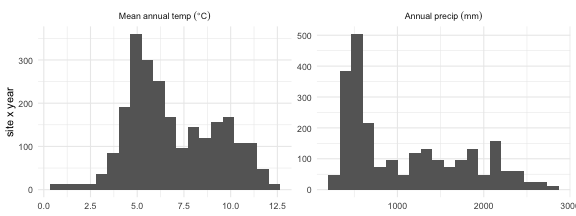
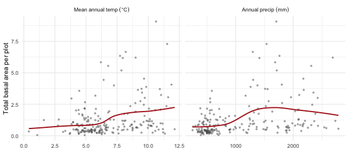
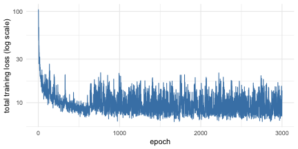
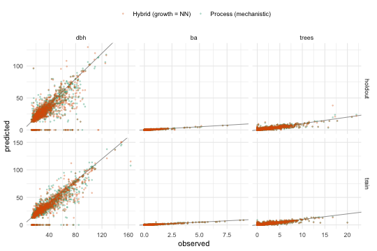
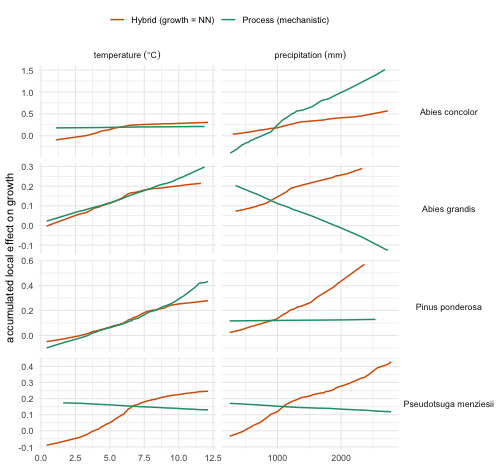
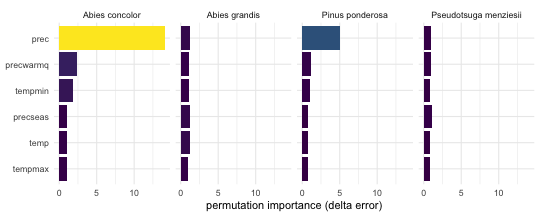
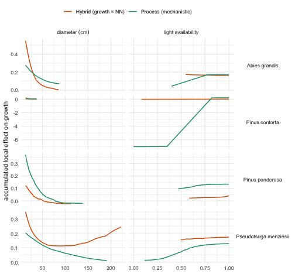

# Fitting FINN to forest inventory data (Oregon, US FIA)

Dynamic forest models are usually developed through a combination of
encoding ecological knowledge into model structures and parameters.
Usually the resulting parameters are then further refined by manual
calibration procedures. Here we calibrate FINN directly from data: a
subset of the US Forest Inventory & Analysis (FIA) program for Oregon,
prepared exactly as in the **Preparing your data for FINN** vignette.

We fit FINN to 200 sites and evaluate on 200 **held-out** sites.

The calibration of the model for all species parameters relies on the a
torch backend and therefor takes several minutes, the vignette is
**precompiled**: `vignettes/build.R` knits `D-Fit_to_FIA.Rmd.orig` once
on a developer machine and commits the resulting static `.Rmd`. So the
code you see is exactly the code that produced the output, and the
package builds anywhere without torch.

``` r

library(FINN)
library(torch)
library(data.table)
library(ggplot2)

# Training length. 500 is comfortably past convergence: every response plateaus
# by ~epoch 400 (checked across 3 seeds). Raising it changes nothing except the
# knit time.
EPOCHS <- 500L
```

## The data

The input tables are built by **`dev/make_extdata.R`**, which draws 400
sites from the full Oregon FIA set in `data-raw/` and splits them into
two train and test data. The **climate** (`fia_env_dt.csv`) was created
in the FINN-fia analysis repo (`scripts/03_attach_environment.R` →
`07_prepare_finn_inputs.R`); see `data-raw/README.md` for the full
chain.

The data consists of 200 sites to fit on, and 200 holdout sites for
evaluation. A fitted FINN model should generalize to other sites. So the
holdout is a genuine out-of-sample test.

``` r

ext <- function(f) system.file("extdata", f, package = "FINN")

# --- training sites --------------------------------------------------------
obs_dt     <- fread(ext("fia_obs_dt.csv"))     # observations, wide (one column per variable)
env_dt     <- fread(ext("fia_env_dt.csv"))     # RAW, untransformed climate
init_trees <- fread(ext("fia_init_trees.csv"))
species_dt <- fread(ext("fia_species_dt.csv"))

# --- holdout sites: never seen during fitting ------------------------------
obs_test   <- fread(ext("fia_obs_test.csv"))
env_test   <- fread(ext("fia_env_test.csv"))
init_test  <- fread(ext("fia_init_test.csv"))

# long form of the observations, so later we can match FINN's long predictions
# (sim$long$site) with a single merge()
resp  <- c("dbh", "ba", "trees", "growth", "mort", "reg")
to_long <- function(d) melt(d, id.vars = c("siteID", "year", "species", "species_name"),
                            measure.vars = resp, variable.name = "variable", value.name = "obs")
obs_long  <- to_long(obs_dt)
test_long <- to_long(obs_test)

cat(sprintf("train: %d sites | holdout: %d sites | %d species | years %s\n",
            uniqueN(obs_dt$siteID), uniqueN(obs_test$siteID), uniqueN(obs_dt$species),
            paste(sort(unique(obs_dt$year)), collapse = " & ")))
#> train: 200 sites | holdout: 200 sites | 11 species | years 1 & 2
species_dt
#>     species            species_name
#>       <int>                  <char>
#>  1:       1   Pseudotsuga menziesii
#>  2:       2         Pinus ponderosa
#>  3:       3          Pinus contorta
#>  4:       4          Abies concolor
#>  5:       5           Abies grandis
#>  6:       6      Tsuga heterophylla
#>  7:       7       Tsuga mertensiana
#>  8:       8 Lithocarpus densiflorus
#>  9:       9             Alnus rubra
#> 10:      10          Abies amabilis
#> 11:      11                   other
```

The environment is supplied in **natural units**: with
`env_autoscale = TRUE` (the default) FINN z-standardizes the predictors
internally and reuses the same constants at prediction time, so raw
values are all we ever pass.

``` r

ggplot(melt(env_dt[, c("temp", "prec")], measure.vars = c("temp", "prec")),
       aes(value)) +
  geom_histogram(bins = 20, fill = "grey40") +
  facet_wrap(~variable, scales = "free", labeller = as_labeller(
    c(temp = "Mean~annual~temp~(degree*C)", prec = "Annual~precip~(mm)"), label_parsed)) +
  labs(x = NULL, y = "site x year") + theme_minimal()
```



Stand abundance, measured as total basal area per plot (summed over
species), against the temperature and precipitation gradients:

``` r

# total stand basal area per plot: sum over species, averaged over inventories
site_ba  <- obs_dt[, .(ba = sum(ba, na.rm = TRUE)), by = .(siteID, year)][
                   , .(ba = mean(ba)), by = siteID]
site_env <- env_dt[, .(temp = mean(temp), prec = mean(prec)), by = siteID]
grad <- melt(merge(site_ba, site_env, by = "siteID"),
             id.vars = c("siteID", "ba"), measure.vars = c("temp", "prec"),
             variable.name = "gradient")

ggplot(grad, aes(value, ba)) +
  geom_point(alpha = 0.4, size = 0.9, colour = "grey30") +
  geom_smooth(method = "loess", se = FALSE, colour = "firebrick", linewidth = 0.9) +
  facet_wrap(~gradient, scales = "free_x", labeller = as_labeller(
    c(temp = "Mean~annual~temp~(degree*C)", prec = "Annual~precip~(mm)"), label_parsed)) +
  labs(x = NULL, y = "Total basal area per plot") + theme_minimal()
```



## Initial cohorts

Each simulation starts from the observed first inventory. We build the
starting state for both samples — the holdout gets its own cohorts, from
its own sites.

``` r

Nsp <- max(obs_dt$species)
init_cohorts      <- makeInitCohorts(init_trees, Nspecies = Nsp)
init_cohorts_test <- makeInitCohorts(init_test,  Nspecies = Nsp)
```

``` r

# shared colours for the two model variants, reused by the scatter and ALE panels
model_cols <- c("Process (mechanistic)" = "#1b9e77", "Hybrid (growth = NN)" = "#d95f02")
```

## Fit a Process-FINN

In the fully mechanistic configuration every process keeps its
predefined form, while its species and environmental parameters are
learned (`optimize* = TRUE`) and the formula chooses which environmental
predictors enter the growth, regeneration and mortality responses. The
model is calibrated end-to-end by gradient descent through the entire
simulation.

We pass **two** climate drivers rather than all six available. `~.`
would use every column, but the six are strongly collinear — `temp` and
`tempmin` correlate at r = 0.93, `prec` and `precwarmq` at 0.86, and two
principal components carry 90% of the variance. Collinear predictors are
not a problem for the *fit* (that is what ALE is designed for), but they
are a problem for the *interpretation* below: two drivers that correlate
at 0.93 have no separately identifiable response curves, so calling each
one a “niche” would be reading structure into an arbitrary split. Two
weakly-correlated drivers (r = 0.64) give curves that mean what the text
says they mean. Measured across three seeds, the cost is nothing on
growth (0.56 vs 0.55 held out) and ~0.02 on basal area, tree numbers and
regeneration.

``` r

FINN.seed(42)
m <- finn(
  N_species            = uniqueN(obs_dt$species),
  recruits_dbh         = 12.9,   # DBH (cm) assigned to a new recruit; ~ FIA's 12.7 cm (5 in) minimum
  competition_process  = createProcess(~0, FINN::competition,  optimizeSpecies = TRUE),
  growth_process       = createProcess(~ temp + prec, FINN::growth,       optimizeSpecies = TRUE, optimizeEnv = TRUE),
  regeneration_process = createProcess(~ temp + prec, FINN::regeneration, optimizeSpecies = TRUE, optimizeEnv = TRUE),
  mortality_process    = createProcess(~ temp + prec, FINN::mortality,    optimizeSpecies = TRUE, optimizeEnv = TRUE)
)
```

``` r

fit(m,
  env         = env_dt,      # raw climate
  data        = obs_dt,
  init_cohort = init_cohorts,
  device      = "cpu",
  epochs      = EPOCHS,
  batchsize   = 40L,
  patches     = 4,
  patch_size  = 0.06,
  lr          = 0.01,
  env_autoscale   = TRUE,        # default
  plot_progress   = FALSE        # the convergence plot below is the readable one
)
```

## Replace growth with a neural network (Hybrid-FINN)

FINN’s defining feature is that **any single demographic process can be
swapped from a mechanistic function to a neural network**, while the
others stay mechanistic — a *hybrid* model. The mechanistic processes
keep the system ecologically constrained; the network absorbs structure
the fixed functional form cannot express. Here we replace **growth**
with a small neural network via
[`createHybrid()`](https://finnverse.github.io/FINN/reference/createHybrid.md),
leaving competition, regeneration and mortality mechanistic, and refit
on the same data with the **identical
[`fit()`](https://finnverse.github.io/FINN/reference/fit.md) call**.

``` r

FINN.seed(42)
m_hybrid <- finn(
  N_species            = uniqueN(obs_dt$species),
  recruits_dbh         = 12.9,
  competition_process  = createProcess(~0, FINN::competition,  optimizeSpecies = TRUE),
  growth_process       = createHybrid(~ temp + prec, hidden = c(20L, 20L), transformer = FALSE),  # NN replaces growth
  regeneration_process = createProcess(~ temp + prec, FINN::regeneration, optimizeSpecies = TRUE, optimizeEnv = TRUE),
  mortality_process    = createProcess(~ temp + prec, FINN::mortality,    optimizeSpecies = TRUE, optimizeEnv = TRUE)
)
```

``` r

fit(m_hybrid,
  env = env_dt, data = obs_dt, init_cohort = init_cohorts, device = "cpu",
  epochs = EPOCHS, batchsize = 40L, patches = 4, patch_size = 0.06,
  lr = 0.01, env_autoscale = TRUE, plot_progress = FALSE
)
```

With both variants fitted, the rest of the vignette inspects and
compares them: training convergence, a
[`summary()`](https://rspatial.github.io/terra/reference/summary.html)
of the learned structure, predicted-vs-observed fit, the learned niches,
and the accumulated local effects that reveal what the network learned.

## Training convergence

Both variants are trained the same way. Because the losses are scaled by
their intercept-only baselines, `m$history` can be read **per response**
on one axis, and the dashed line at 1 is a real reference: it is the
intercept-only model, so a curve below it means that response is
predicted better than by its own mean.

``` r

hist_dt <- as.data.table(do.call(rbind, m$history))[, 1:6]
setnames(hist_dt, c("dbh", "ba", "trees", "growth", "mort", "reg"))
hist_dt[, epoch := .I]
ggplot(melt(hist_dt, id.vars = "epoch", variable.name = "response"),
       aes(epoch, value, colour = response)) +
  geom_hline(yintercept = 1, linetype = "dashed", colour = "grey40") +
  geom_line(alpha = 0.8) +
  scale_y_log10() +
  scale_colour_viridis_d() +
  labs(x = "epoch", y = "loss / intercept-only baseline\n(1 = no better than the mean)",
       colour = NULL) +
  theme_minimal()
```



The structural responses drop well below 1 within a few epochs. The
per-tree rates sit much closer to it — they are only weakly constrained
by two inventories, which is the honest picture and the reason for the
caveat further down.

## What the model learned — `summary()`

[`summary()`](https://rspatial.github.io/terra/reference/summary.html)
gives a compact overview of the *learned structure*: for each process
and species it reports how important each environmental predictor is
(ALE-variance importance, rate-normalised) and its average conditional
effect. It reuses the cached conditional effects, so once
[`ALE()`](https://finnverse.github.io/FINN/reference/ALE.md) (below) or
a previous
[`summary()`](https://rspatial.github.io/terra/reference/summary.html)
has run it needs no further simulation.

``` r
summary(m)
FINN model summary
==================

### GROWTH

Analytical ALE importance (rate-normalised) (species in columns):
 variable    sp1    sp2      sp3      sp4      sp5   sp6   sp7    sp8   sp9
     temp 0.0242 0.0133 0.744175 0.000735 0.000385 0.473 0.489 2.7839 0.342
     prec 0.2288 2.5776 0.000987 0.005823 0.002549 0.297 0.383 0.0168 0.635
   sp10   sp11
 2.7389 0.0854
 0.0286 0.4186

Average conditional effects (mean; species in columns):
 variable     sp1     sp2     sp3      sp4      sp5    sp6    sp7      sp8
     temp -0.0158 0.00638 0.07445 -0.00308  0.00199 0.0975 0.0421 -0.03546
     prec  0.0497 0.08533 0.00361 -0.01113 -0.00454 0.0713 0.0354 -0.00381
     sp9    sp10    sp11
 -0.0879  0.2412 -0.0218
  0.1042 -0.0224  0.0496

### MORTALITY

Analytical ALE importance (rate-normalised) (species in columns):
 variable    sp1    sp2    sp3   sp4  sp5    sp6    sp7    sp8      sp9  sp10
     prec 0.0605 3.6817 0.4992 0.201 1.07 0.0711 0.5722 0.0183 0.292514 1.192
     temp 0.0508 0.0545 0.0836 0.200 0.41 1.9825 0.0238 1.5557 0.000331 0.237
   sp11
 0.0151
 0.3825

Average conditional effects (mean; species in columns):
 variable     sp1      sp2     sp3     sp4    sp5      sp6     sp7     sp8
     prec 0.00770  0.02773 0.02021 -0.0245 0.0262 -0.00244 -0.0976 -0.0102
     temp 0.00742 -0.00326 0.00883 -0.0211 0.0232 -0.01712  0.0149 -0.0645
       sp9    sp10    sp11
  0.009963 -0.0741 -0.0066
 -0.000322 -0.0302 -0.0297

### REGENERATION

Analytical ALE importance (rate-normalised) (species in columns):
 variable     sp1   sp2   sp3    sp4   sp5    sp6   sp7   sp8   sp9  sp10  sp11
     prec 0.00331 0.923 0.148 1.1918 0.337 1.0344 0.501 0.294 0.677 0.701 1.169
     temp 0.91140 0.144 0.564 0.0518 0.676 0.0754 0.860 0.452 0.423 0.360 0.132

Average conditional effects (mean; species in columns):
 variable   sp1    sp2   sp3    sp4    sp5   sp6    sp7     sp8   sp9   sp10
     prec 0.143 -3.083 -1.33 -0.410 -0.794 0.487  0.500 0.00812 0.543  1.074
     temp 2.604  0.766 -1.62  0.077 -0.644 0.125 -0.553 0.01056 0.389 -0.827
   sp11
  1.525
 -0.514
```

The niche and ALE sections below unpack this overview into per-driver
response *curves*.

## Assess the fit — in-sample and on held-out sites

The fit was calibrated on the 200 training sites, so scoring it there
only tells us how well it *reproduces* them. The honest question is
whether it transfers, so we simulate each model twice — once on the
training sites, once on the 200 held-out sites — and score both with
**Spearman correlation** (rank agreement) and **RMSE** (in each
response’s own units), matched on site × year × species.

``` r

# One prediction pass per model x sample. The holdout is driven only by its own
# environment and starting cohorts; nothing about it entered the fit.
pred_of <- function(model, label, env, init, obs_l, split) {
  model$eval()                                   # deterministic: dropout off
  sim <- predict(model, env = env, init_cohort = init,
                 patches = 4, patch_size = 0.06, device = "cpu")
  merge(obs_l, sim$long$site, by = c("siteID", "year", "species", "variable"
  ))[, `:=`(model = label, split = split)][]
}
FINN.seed(1)
obs_pred <- rbind(
  pred_of(m,        "Process (mechanistic)", env_dt,   init_cohorts,      obs_long,  "train"),
  pred_of(m,        "Process (mechanistic)", env_test, init_cohorts_test, test_long, "holdout"),
  pred_of(m_hybrid, "Hybrid (growth = NN)",  env_dt,   init_cohorts,      obs_long,  "train"),
  pred_of(m_hybrid, "Hybrid (growth = NN)",  env_test, init_cohorts_test, test_long, "holdout"))

metrics <- obs_pred[is.finite(obs) & is.finite(value),
                    .(spearman = round(cor(obs, value, method = "spearman"), 2),
                      rmse     = round(sqrt(mean((obs - value)^2)), 2),
                      n        = .N), by = .(model, split, variable)]

comparison <- dcast(metrics, variable + model ~ split, value.var = c("spearman", "rmse"))
setcolorder(comparison, c("variable", "model", "spearman_train", "spearman_holdout",
                          "rmse_train", "rmse_holdout"))
comparison[order(variable, model)]
#> Key: <variable, model>
#>     variable                 model spearman_train spearman_holdout rmse_train
#>       <fctr>                <char>          <num>            <num>      <num>
#>  1:      dbh  Hybrid (growth = NN)           0.80             0.73      13.05
#>  2:      dbh Process (mechanistic)           0.80             0.73      12.93
#>  3:       ba  Hybrid (growth = NN)           0.80             0.79       0.12
#>  4:       ba Process (mechanistic)           0.80             0.80       0.12
#>  5:    trees  Hybrid (growth = NN)           0.78             0.77       0.75
#>  6:    trees Process (mechanistic)           0.78             0.78       0.77
#>  7:   growth  Hybrid (growth = NN)           0.58             0.50       0.09
#>  8:   growth Process (mechanistic)           0.60             0.56       0.10
#>  9:     mort  Hybrid (growth = NN)           0.18             0.04       0.15
#> 10:     mort Process (mechanistic)           0.17             0.03       0.15
#> 11:      reg  Hybrid (growth = NN)           0.23             0.23       6.20
#> 12:      reg Process (mechanistic)           0.23             0.24       6.22
#>     rmse_holdout
#>            <num>
#>  1:        13.89
#>  2:        13.78
#>  3:         0.09
#>  4:         0.09
#>  5:         0.77
#>  6:         0.78
#>  7:         0.10
#>  8:         0.11
#>  9:         0.16
#> 10:         0.15
#> 11:         6.47
#> 12:         6.46
```

The structural variables — basal area, tree numbers and diameter — are
reconstructed well, **and hold up on sites the model never saw**: that
gap between the train and holdout columns is the part that matters,
because it is the only evidence that the fitted processes generalise
rather than memorise. The noisier per-tree rates (growth, mortality,
regeneration) are harder to constrain from two inventories and should be
read with that in mind (see the caveat below). The hybrid tracks the
mechanistic model on the structural variables — with **no growth
equation specified** — which is what makes hybrids useful when a
process’s form is uncertain; the surrounding mechanistic processes still
anchor the model ecologically.

``` r

# facet_wrap, NOT facet_grid: the three responses live on completely different
# scales (dbh ~150 cm, ba ~8 m2, trees ~20). facet_grid(scales = "free") frees x
# per column but y per ROW, so ba and trees would be drawn on dbh's y-axis -
# squashing them onto y = 0 and flattening the 1:1 line until a good fit looks
# like a broken one. facet_wrap frees both axes per panel.
ggplot(obs_pred[variable %in% c("dbh", "ba", "trees") & is.finite(obs)],
       aes(obs, value, colour = model)) +
  geom_abline(slope = 1, intercept = 0, colour = "grey40", linewidth = 0.3) +
  geom_point(alpha = 0.25, size = 0.5) +
  facet_wrap(~ split + variable, scales = "free", ncol = 3,
             labeller = labeller(.multi_line = FALSE)) +
  scale_colour_manual(values = model_cols) +
  labs(x = "observed", y = "predicted", colour = NULL) +
  theme_minimal() + theme(legend.position = "top")
```



Each panel is on its **own** axes, and the grey line is 1:1 — so the
diagonal is the target in every panel regardless of the units on it.

> **A caveat on the rate variables.** `growth`, `mort` and `reg` are
> per-tree rates and are only weakly constrained by two inventories, so
> their Spearman is a **noisy estimate** — refitting with a different
> random seed moves it by a few hundredths. Differences of that size
> between the models should not be over-read; the structural variables,
> estimated from far more information, are what carry the comparison.
> `mort` is the extreme case and gets a vignette of its own —
> **Mortality: a binomial response and a neural-network process** —
> because rank correlation is the wrong tool for a response that is
> mostly zeros.

## Interpreting the growth process with ALE

[`ALE()`](https://finnverse.github.io/FINN/reference/ALE.md) returns the
**accumulated local effect** of every driver on each process — the
effect measure of choice when predictors are correlated, because it
accumulates *local* changes within the observed data instead of
extrapolating to unrealistic combinations. Running it on **both** fitted
models lets us read what growth responds to *and* compare the
mechanistic process with the neural-network hybrid, across growth’s
**structural** inputs (tree size, light) and its **environmental niche**
(climate). It returns one table per process (`growth`, `mortality`,
`regeneration`); we use the growth table of each model.

``` r

FINN.seed(1)
ale_proc <- ALE(m,        env_dt, init_cohorts, plot = FALSE)   # mechanistic growth
ale_hyb  <- ALE(m_hybrid, env_dt, init_cohorts, plot = FALSE)   # growth = NN

# one tidy table with both variants. Environmental drivers come back on the
# model's scaled axis, so back-transform temp/prec to natural units (deg C, mm);
# the structural drivers (dbh, light) are already on their natural axes.
to_natural <- function(a, model) {
  sc <- as.data.table(model$env_scaling)[, .(var = variable, center, scale)]
  merge(data.table(a), sc, by = "var", all.x = TRUE)[!is.na(center), x := x * scale + center]
}
growth <- rbind(
  to_natural(ale_proc$growth, m)[,        model := "Process (mechanistic)"],
  to_natural(ale_hyb$growth,  m_hybrid)[, model := "Hybrid (growth = NN)"])
growth <- merge(growth, species_dt, by = "species")
```

One helper plots the growth ALE of both variants for any set of drivers
— one panel per species × driver, with **independent axes** so responses
of very different magnitude stay legible side by side:

``` r

plot_growth_ale <- function(vars, labs) {
  d <- growth[var %in% vars & species %in% c(1, 2, 4, 5)]   # the four focal species
  d[, var := factor(var, levels = names(labs))]
  ggplot(d, aes(x, ale, colour = model)) +
    geom_line(linewidth = 0.7) +
    facet_grid(species_name ~ var, scales = "free",
               labeller = labeller(var = as_labeller(labs, label_parsed),
                                    species_name = label_value)) +
    scale_colour_manual(values = model_cols) +
    labs(x = NULL, y = "accumulated local effect on growth", colour = NULL) +
    theme_minimal() + theme(legend.position = "top", strip.text.y = element_text(angle = 0))
}
```

### Environmental niches

Because the environmental responses are learned rather than prescribed,
each curve is an inferred **niche** — how a species’ growth scales along
a climate gradient. Growth generally rises with precipitation, and the
temperature responses are single-peaked, with an optimum in the middle
of the sampled range.

Read these as *illustrations of what ALE recovers*, not as settled
ecology. The per-species shapes are noisier than the structural
responses below — growth is weakly constrained by two inventories (see
the caveat above), and the mechanistic and hybrid curves do not always
agree, even on the sign of a response. That disagreement is itself
informative: where two models trained on the same data diverge, the data
are not pinning that response down.

``` r

plot_growth_ale(c("temp", "prec"),
                c(temp = "temperature~(degree*C)", prec = "precipitation~(mm)"))
```



### Which drivers matter — `feature_importance()`

The niches show the *shape* of each response;
[`feature_importance()`](https://finnverse.github.io/FINN/reference/feature_importance.md)
gives its *magnitude*. It permutes each environmental predictor and
re-simulates, measuring the resulting increase in prediction error — a
re-simulation counterpart to the analytical importance in
[`summary()`](https://rspatial.github.io/terra/reference/summary.html).
Below we read off the importances for the growth process of the four
focal species:

``` r

FINN.seed(1)
fi <- feature_importance(m, env_dt, init_cohorts, nperm = 20L, seed = 1L,
                         patches = 4, patch_size = 0.06, device = "cpu")
fimp_growth <- merge(data.table(fi$growth)[species %in% c(1, 2, 4, 5)],
                     species_dt, by = "species")
```

``` r

ggplot(fimp_growth, aes(reorder(variable, importance), importance, fill = importance)) +
  geom_col() +
  coord_flip() +
  facet_wrap(~species_name, nrow = 1) +
  scale_fill_viridis_c(guide = "none") +
  labs(x = NULL, y = "permutation importance (delta error)") + theme_minimal()
```



Each species leans on a different climate driver — the importances are
learned per species, not shared.

### Response to size and light — did the network recover the mechanistic form?

The point of a hybrid is to ask which functional form the neural network
learned and how it *compares* to the mechanistic function it replaced.
Here the two agree on the structural responses that are well constrained
by the data: growth **declines with tree size** and **increases with
light availability** for every species, and the network recovered both
shapes without being given the functional form. That agreement is the
useful result — it says the mechanistic size-and-light response was a
reasonable choice, and that a flexible network, free to do anything,
reproduces it. The remaining gaps between the curves are small next to
the noise in the rate itself.

``` r

plot_growth_ale(c("dbh", "light"),
                c(dbh = "diameter~(cm)", light = "light~availability"))
```



Each curve spans only the range its *own* model actually simulates (ALE
never extrapolates), so where the process and hybrid cover different
ranges — as for *Abies grandis* light — the two models simply place that
species in different conditions; the mismatch is information, not an
artefact.

``` r

sessionInfo()
#> R version 4.5.0 (2025-04-11)
#> Platform: aarch64-apple-darwin20
#> Running under: macOS 26.5.1
#> 
#> Matrix products: default
#> BLAS:   /Library/Frameworks/R.framework/Versions/4.5-arm64/Resources/lib/libRblas.0.dylib 
#> LAPACK: /Library/Frameworks/R.framework/Versions/4.5-arm64/Resources/lib/libRlapack.dylib;  LAPACK version 3.12.1
#> 
#> locale:
#> [1] C
#> 
#> time zone: Europe/Berlin
#> tzcode source: internal
#> 
#> attached base packages:
#> [1] stats     graphics  grDevices utils     datasets  methods   base     
#> 
#> other attached packages:
#> [1] ggplot2_3.5.2     data.table_1.17.8 torch_0.15.1      FINN_0.1.0       
#> 
#> loaded via a namespace (and not attached):
#>  [1] Matrix_1.7-3       bit_4.6.0          gtable_0.3.6       dplyr_1.1.4       
#>  [5] compiler_4.5.0     tidyselect_1.2.1   Rcpp_1.1.0         callr_3.7.6       
#>  [9] splines_4.5.0      scales_1.4.0       lattice_0.22-6     R6_2.6.1          
#> [13] labeling_0.4.3     generics_0.1.4     knitr_1.50         tibble_3.3.0      
#> [17] pillar_1.11.0      RColorBrewer_1.1-3 rlang_1.2.0        xfun_0.57         
#> [21] bit64_4.6.0-1      viridisLite_0.4.2  cli_3.6.6          withr_3.0.2       
#> [25] magrittr_2.0.3     mgcv_1.9-1         ps_1.9.1           grid_4.5.0        
#> [29] processx_3.8.6     lifecycle_1.0.5    nlme_3.1-168       coro_1.1.0        
#> [33] vctrs_0.6.5        evaluate_1.0.5     glue_1.8.0         farver_2.1.2      
#> [37] abind_1.4-8        tools_4.5.0        pkgconfig_2.0.3
```
