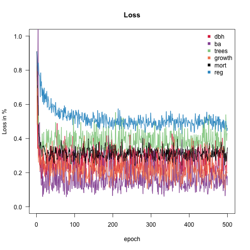
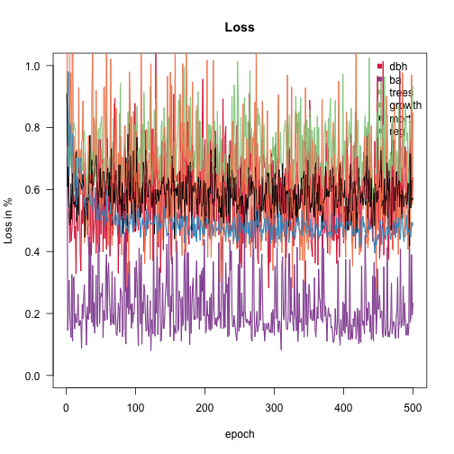
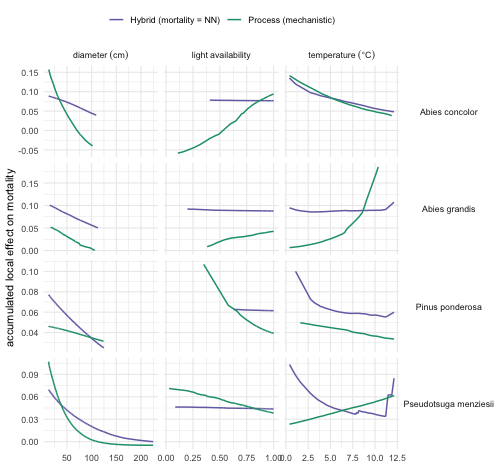

# Mortality: a binomial response and a neural-network process

Mortality is the hardest of FINN’s six responses to calibrate, and the
one where the choice of likelihood matters most. This vignette takes it
on its own terms: what the observation actually *is*, which likelihood
belongs to it, how to swap the process for a neural network, and — the
part that is easy to get wrong — how to score the result.

It follows the same 200-fit / 200-holdout FIA sample as **Fitting FINN
to forest inventory data**, and like that page it is **precompiled** by
`vignettes/build.R`: the models below are really trained.

``` r

library(FINN)
library(torch)
library(data.table)
library(ggplot2)

EPOCHS <- 500L
```

## Mortality is a proportion, not a rate

[`makeObsData()`](https://finnverse.github.io/FINN/reference/makeObsData.md)
returns mortality as a **pair of counts** rather than a bare rate:

- **`n_at_risk`** — trees alive at the *start* of an inventory interval,
- **`n_died`** — how many of those were dead at the *end*,

with `mort = n_died / n_at_risk` derived for convenience. This is
exactly the `cbind(died, survived)` response of a binomial GLM, and it
is deliberate. A bare proportion throws away the sample size: it cannot
tell a site where 1 of 1 trees died from one where 60 of 60 did, even
though the second carries sixty times the information.

The pair is a **closed cohort** — both columns are pinned to the tree’s
state at the start of the interval. That matters more than it sounds.
FIA re-identifies a tree’s species between visits, so a rate built by
dividing “deaths this year” by “survivors last year” can book a death
against the species a tree *ended* as while the denominator counted the
species it *started* as, and report more deaths than there were trees.
Pinning both columns to the interval start makes `n_died <= n_at_risk`
true by construction. (Trees that *recruit* during the interval are in
neither column; see
[`?makeObsData`](https://finnverse.github.io/FINN/reference/makeObsData.md)
for the open-cohort alternative.)

``` r

ext <- function(f) system.file("extdata", f, package = "FINN")

obs_dt     <- fread(ext("fia_obs_dt.csv"))
env_dt     <- fread(ext("fia_env_dt.csv"))
init_trees <- fread(ext("fia_init_trees.csv"))
species_dt <- fread(ext("fia_species_dt.csv"))

obs_test   <- fread(ext("fia_obs_test.csv"))
env_test   <- fread(ext("fia_env_test.csv"))
init_test  <- fread(ext("fia_init_test.csv"))

obs_dt[, .(siteID, year, species_name, n_at_risk, n_died, mort)][n_at_risk > 0][1:6]
#>    siteID  year          species_name n_at_risk n_died      mort
#>     <int> <int>                <char>     <int>  <int>     <num>
#> 1:      1     1 Pseudotsuga menziesii         2      0 0.0000000
#> 2:      1     1         Abies grandis         6      0 0.0000000
#> 3:      1     1                 other         3      1 0.3333333
#> 4:      1     2 Pseudotsuga menziesii         2      0 0.0000000
#> 5:      1     2         Abies grandis        10      0 0.0000000
#> 6:      1     2                 other         2      0 0.0000000
```

How much mortality signal is actually in this sample? Less than the
number of rows suggests:

``` r

cat(sprintf("observations with a cohort at risk : %d\n", obs_dt[n_at_risk > 0, .N]))
#> observations with a cohort at risk : 1003
cat(sprintf("of which mort is exactly zero      : %d (%.0f%%)\n",
            obs_dt[n_at_risk > 0 & n_died == 0, .N],
            100 * obs_dt[n_at_risk > 0, mean(n_died == 0)]))
#> of which mort is exactly zero      : 688 (69%)
cat(sprintf("trees at risk (train)              : %d\n", obs_dt[, sum(n_at_risk)]))
#> trees at risk (train)              : 9907
cat(sprintf("deaths (train)                     : %d\n", obs_dt[, sum(n_died)]))
#> deaths (train)                     : 656
cat(sprintf("pooled mortality rate              : %.3f per inventory interval\n",
            obs_dt[, sum(n_died) / sum(n_at_risk)]))
#> pooled mortality rate              : 0.066 per inventory interval
```

A few hundred deaths, and roughly two-thirds of the observations at
exactly zero. No likelihood can manufacture information that is not
there — but the wrong one can waste what is.

## Why `binomial` and not `mse`

FINN scores mortality with `loss = c(..., mortality = "binomial", ...)`
by default. Squared error assumes an unbounded response with constant
variance; mortality is neither. A proportion lives on
``` math
0, 1
```
and its variance *shrinks* as the rate approaches either end — so on a
response that is ~69% zeros, MSE puts almost no gradient where the data
actually are.

The binomial term is weighted by `n_at_risk`, which is what turns a
Bernoulli term into a binomial one. It is the same thing R does with
`glm(prop ~ ., family = binomial, weights = n)`.

## Two models: mechanistic mortality, and mortality as a network

``` r

Nsp          <- uniqueN(obs_dt$species)
init_cohorts      <- makeInitCohorts(init_trees, Nspecies = Nsp)
init_cohorts_test <- makeInitCohorts(init_test,  Nspecies = Nsp)
```

The mechanistic baseline, with all four processes in their functional
form:

``` r

FINN.seed(42)
m <- finn(
  N_species            = Nsp,
  recruits_dbh         = 12.9,
  competition_process  = createProcess(~0, FINN::competition,  optimizeSpecies = TRUE),
  growth_process       = createProcess(~ temp + prec, FINN::growth,       optimizeSpecies = TRUE, optimizeEnv = TRUE),
  regeneration_process = createProcess(~ temp + prec, FINN::regeneration, optimizeSpecies = TRUE, optimizeEnv = TRUE),
  mortality_process    = createProcess(~ temp + prec, FINN::mortality,    optimizeSpecies = TRUE, optimizeEnv = TRUE)
)
```

``` r

fit(m,
  env = env_dt, data = obs_dt, init_cohort = init_cohorts, device = "cpu",
  epochs = EPOCHS, batchsize = 40L, patches = 4, patch_size = 0.06,
  lr = 0.01, env_autoscale = TRUE
)
```



Now the same model with **mortality replaced by a neural network** —
every other process, and the entire
[`fit()`](https://finnverse.github.io/FINN/reference/fit.md) call,
unchanged.
[`createHybrid()`](https://finnverse.github.io/FINN/reference/createHybrid.md)
is the only difference:

``` r

FINN.seed(42)
m_mort <- finn(
  N_species            = Nsp,
  recruits_dbh         = 12.9,
  competition_process  = createProcess(~0, FINN::competition,  optimizeSpecies = TRUE),
  growth_process       = createProcess(~ temp + prec, FINN::growth,       optimizeSpecies = TRUE, optimizeEnv = TRUE),
  regeneration_process = createProcess(~ temp + prec, FINN::regeneration, optimizeSpecies = TRUE, optimizeEnv = TRUE),
  mortality_process    = createHybrid(~ temp + prec, hidden = c(20L, 20L), transformer = FALSE)
)
```

``` r

fit(m_mort,
  env = env_dt, data = obs_dt, init_cohort = init_cohorts, device = "cpu",
  epochs = EPOCHS, batchsize = 40L, patches = 4, patch_size = 0.06,
  lr = 0.01, env_autoscale = TRUE
)
```



## Scoring mortality: why not Spearman

``` r

pred_of <- function(model, label, env, init, obs_l, split) {
  model$eval()
  sim <- predict(model, env = env, init_cohort = init,
                 patches = 4, patch_size = 0.06, device = "cpu")
  merge(obs_l, sim$long$site, by = c("siteID", "year", "species", "variable"
  ))[, `:=`(model = label, split = split)][]
}
to_long <- function(d) melt(d, id.vars = c("siteID", "year", "species", "species_name"),
                            measure.vars = "mort", variable.name = "variable", value.name = "obs")

FINN.seed(1)
obs_pred <- rbind(
  pred_of(m,      "Process (mechanistic)",   env_dt,   init_cohorts,      to_long(obs_dt),   "train"),
  pred_of(m,      "Process (mechanistic)",   env_test, init_cohorts_test, to_long(obs_test), "holdout"),
  pred_of(m_mort, "Hybrid (mortality = NN)", env_dt,   init_cohorts,      to_long(obs_dt),   "train"),
  pred_of(m_mort, "Hybrid (mortality = NN)", env_test, init_cohorts_test, to_long(obs_test), "holdout"))
```

Rank correlation is the natural first reach, and it is a trap here.
Two-thirds of the observed proportions are exactly zero, so Spearman
spends most of its power ranking ties against each other; a value near
zero cannot distinguish “the model learned nothing” from “the metric
cannot see what it learned”.

``` r

obs_pred[is.finite(obs) & is.finite(value),
         .(spearman = round(cor(obs, value, method = "spearman"), 2), n = .N),
         by = .(model, split)][order(split, model)]
#>                      model   split spearman     n
#>                     <char>  <char>    <num> <int>
#> 1: Hybrid (mortality = NN) holdout     0.12   994
#> 2:   Process (mechanistic) holdout     0.03   994
#> 3: Hybrid (mortality = NN)   train     0.19  1003
#> 4:   Process (mechanistic)   train     0.17  1003
```

**AUC** asks the question the binomial actually poses: does the model
give a higher death probability to a tree that died than to one that
survived? Each observation stands for `n_at_risk` Bernoulli trials of
which `n_died` are deaths, all sharing that observation’s predicted
probability — so rather than expand the trials we weight them, with tied
predictions taking half credit (the standard Mann-Whitney treatment).

``` r

auc_binom <- function(p, pos, neg) {
  g <- data.table(p = p, pos = pos, neg = neg)[
    , .(pos = sum(pos), neg = sum(neg)), by = p][order(p)]
  neg_below <- cumsum(g$neg) - g$neg              # negatives strictly below each p
  den <- sum(g$pos) * sum(g$neg)
  if (den == 0) return(NA_real_)
  sum(g$pos * (neg_below + 0.5 * g$neg)) / den    # 0.5 credit for ties
}

counts <- rbind(
  obs_dt[,   .(siteID, year, species, n_at_risk, n_died, split = "train")],
  obs_test[, .(siteID, year, species, n_at_risk, n_died, split = "holdout")])
mort_pred <- merge(obs_pred, counts, by = c("siteID", "year", "species", "split"))

auc_tab <- mort_pred[is.finite(value) & n_at_risk > 0,
  .(AUC     = round(auc_binom(value, n_died, n_at_risk - n_died), 3),
    deaths  = sum(n_died),
    at_risk = sum(n_at_risk)), by = .(model, split)]
auc_tab[order(split, -AUC)]
#>                      model   split   AUC deaths at_risk
#>                     <char>  <char> <num>  <int>   <int>
#> 1: Hybrid (mortality = NN) holdout 0.573    727   10013
#> 2:   Process (mechanistic) holdout 0.517    727   10013
#> 3: Hybrid (mortality = NN)   train 0.648    656    9907
#> 4:   Process (mechanistic)   train 0.609    656    9907
```

0.5 is coin-flipping, 1.0 is perfect ranking.

Read the two splits **together**, because the gap between them is the
result. On the training sites the model ranks deaths above survivors
better than chance — so there *is* a learnable mortality signal, and the
model finds it. On the held-out sites that skill collapses to ~0.5. The
model is not failing to fit mortality; it is fitting it and **not
generalising**.

That is what a few hundred deaths buys. With ~66% of observations at
exactly zero and mortality concentrated in whichever species happened to
die on whichever plot, there is enough signal to memorise and not enough
to transfer. The network variant sits *lower* still on the holdout,
which is what you would expect from a model with more capacity to
memorise with.

So mortality here is honestly reported as **not identified
out-of-sample**. The binomial likelihood is the right loss for a
proportion and the closed cohort is the right response, but neither
manufactures information the two inventories do not contain. Treat
differences between the two models as noise; the signal worth reading is
train-vs-holdout, not model-vs-model.

## What the network learned — ALE

[`ALE()`](https://finnverse.github.io/FINN/reference/ALE.md) returns one
table per process, so the same tool reads a mechanistic mortality
function and a neural network standing in its place. The effect is on
the mortality **probability** per inventory interval.

``` r

FINN.seed(1)
ale_proc <- ALE(m,      env_dt, init_cohorts, plot = FALSE)
ale_hyb  <- ALE(m_mort, env_dt, init_cohorts, plot = FALSE)

to_natural <- function(a, model) {
  sc <- as.data.table(model$env_scaling)[, .(var = variable, center, scale)]
  merge(data.table(a), sc, by = "var", all.x = TRUE)[!is.na(center), x := x * scale + center]
}
mortality <- rbind(
  to_natural(ale_proc$mortality, m)[,      model := "Process (mechanistic)"],
  to_natural(ale_hyb$mortality,  m_mort)[, model := "Hybrid (mortality = NN)"])
mortality <- merge(mortality, species_dt, by = "species")
```

``` r

d <- mortality[var %in% c("dbh", "light", "temp") & species %in% c(1, 2, 4, 5)]
d[, var := factor(var, levels = c("dbh", "light", "temp"))]
ggplot(d, aes(x, ale, colour = model)) +
  geom_line(linewidth = 0.7) +
  facet_grid(species_name ~ var, scales = "free",
             labeller = labeller(
               var = as_labeller(c(dbh = "diameter~(cm)", light = "light~availability",
                                   temp = "temperature~(degree*C)"), label_parsed),
               species_name = label_value)) +
  scale_colour_manual(values = model_cols) +
  labs(x = NULL, y = "accumulated local effect on mortality", colour = NULL) +
  theme_minimal() + theme(legend.position = "top", strip.text.y = element_text(angle = 0))
```



Each curve spans only the range its own model actually simulates — ALE
never extrapolates — so where the two cover different ranges they are
simply placing a species in different conditions.

Read these as a demonstration of the *mechanism*: a process can be
replaced by a network and still be interrogated with the same tool. They
are not a settled mortality response. With a few hundred deaths the
network is free to flatten wherever the data do not constrain it, and a
flat ALE here is as likely to mean “no signal” as “no effect”.

``` r

sessionInfo()
#> R version 4.5.0 (2025-04-11)
#> Platform: aarch64-apple-darwin20
#> Running under: macOS 26.5.1
#> 
#> Matrix products: default
#> BLAS:   /Library/Frameworks/R.framework/Versions/4.5-arm64/Resources/lib/libRblas.0.dylib 
#> LAPACK: /Library/Frameworks/R.framework/Versions/4.5-arm64/Resources/lib/libRlapack.dylib;  LAPACK version 3.12.1
#> 
#> locale:
#> [1] C
#> 
#> time zone: Europe/Berlin
#> tzcode source: internal
#> 
#> attached base packages:
#> [1] stats     graphics  grDevices utils     datasets  methods   base     
#> 
#> other attached packages:
#> [1] torch_0.15.1      ggplot2_3.5.2     data.table_1.17.8 FINN_0.1.0       
#> 
#> loaded via a namespace (and not attached):
#>  [1] vctrs_0.6.5        cli_3.6.6          knitr_1.50         rlang_1.2.0       
#>  [5] xfun_0.57          processx_3.8.6     generics_0.1.4     coro_1.1.0        
#>  [9] labeling_0.4.3     glue_1.8.0         bit_4.6.0          ps_1.9.1          
#> [13] scales_1.4.0       grid_4.5.0         abind_1.4-8        evaluate_1.0.5    
#> [17] tibble_3.3.0       lifecycle_1.0.5    compiler_4.5.0     dplyr_1.1.4       
#> [21] RColorBrewer_1.1-3 Rcpp_1.1.0         pkgconfig_2.0.3    farver_2.1.2      
#> [25] viridisLite_0.4.2  R6_2.6.1           tidyselect_1.2.1   pillar_1.11.0     
#> [29] callr_3.7.6        magrittr_2.0.3     withr_3.0.2        tools_4.5.0       
#> [33] bit64_4.6.0-1      gtable_0.3.6
```
