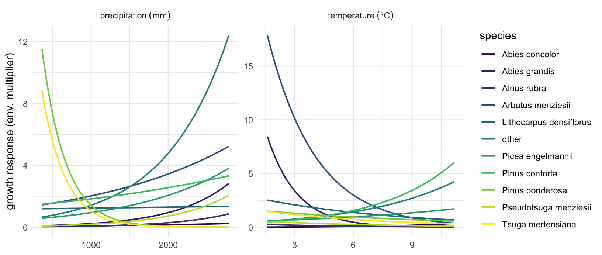
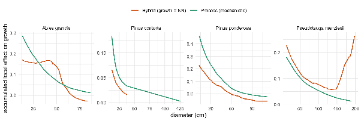
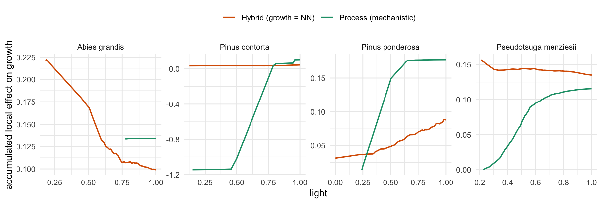

<!--
================================================================================
SOFTWARE-NOTE MANUSCRIPT.

- Section structure and PROSE are taken from FINN-true-software-note.md
  (Yannek's Google-Doc draft), inserted VERBATIM. No text was auto-generated or
  edited (typos, escapes and smart quotes are kept as in the draft).
- The CODE chunks are the actual worked examples from the package vignettes
  (C-Data_preparation and D-Fit_to_FIA), reused directly. The draft's own
  "Code 1/2/3" listings are represented by these live chunks; the draft prose
  refers to them as Code 1, Code 2, Code 3.
- Draft figures (the base64 images from the Doc) are saved under
  figures/draft/ (image1 = Figure 2 niches; image2 = Figure 3 ALE diameter;
  image3 = Figure 4 ALE light) and referenced where the draft placed them.
  These are the draft's rendered outputs; the precompile step can regenerate
  them from the code chunks.

PRECOMPILE (like the vignettes / cito note): a torch backend is required to run
the fits. Chunks are `eval = FALSE` by default so the scaffold knits for a
structure check without training. Set eval = TRUE (below) and precompile once,
committing the knitted output + figures (see vignettes/build.R for the pattern).

Style references (for the writing): r3PG software note
(doi:10.1111/2041-210X.13474) and cito software note (doi:10.1111/ecog.07143).
================================================================================
-->

```{r setup, include = FALSE}
# Flip to eval = TRUE and precompile with a torch backend to run the analysis.
knitr::opts_chunk$set(echo = TRUE, eval = FALSE, message = FALSE, warning = FALSE,
                      fig.path = "figures/", fig.width = 7)
library(FINN)
library(torch)
library(data.table)
library(ggplot2)
EPOCHS <- 500L
```

# Abstract

1. Dynamic vegetation models (DVMs) are central tools for projecting forest dynamics, but their predictions depend on assumptions about the functional forms of demographic processes. Replacing such uncertain processes with flexible non-parametric components, in particular deep neural networks (DNN), is a promising way to let data inform process structure rather than imposing it a priori. A key requirement for this hybrid modelling approach, is that mechanistic and empirical components are calibrated jointly, to ensure that their coupling is compatible and consistent with observed data.
2. Here, we present FINN (Forest-Informed Neural Networks), a flexible R package that implements a forest gap model in which any demographic process can be specified either mechanistically or as a DNN. Unlike common plug-in estimators, which fit non-parametric components separately, FINN trains all components end-to-end, so that the entire model is calibrated as a coherent unit. FINN is implemented in torch for R, a modern deep learning framework that provides the automatic differentiation required for end-to-end training and allows the model to run on the GPU, allowing FINN to scale efficiently to large numbers of sites. A simple, consistent interface lets users control which processes are represented by DNN, without modifying the underlying model.
3. We demonstrate FINN using Forest Inventory and Analysis (FIA) data for Oregon by showing how the growth process can be replaced by a deep neural network, and how the learned process can subsequently be interpreted with accumulated local effect (ALE) plots, recovering an ecologically interpretable functional form from the fitted network.
4. With FINN, we provide ecologists with an accessible framework for hybrid forest modelling that allows them to introduce empirical flexibility where process knowledge is weakest, while retaining the structure and interpretability of a mechanistic model. We expect this combination to be especially useful for projecting forest dynamics under environmental conditions outside the range of the calibration data.

# Introduction

Dynamic vegetation models (DVMs) are widely used to understand and predict forest dynamics, which shape habitats and regulate carbon and water cycles (Forzieri et al., 2022; McDowell et al., 2020). DVMs serve as "repositories of integrated ecosystem knowledge" (Botkin et al., 1972), simulating how mechanistic processes such as growth, mortality, regeneration and competition interact to produce emergent patterns such as succession trajectories (Bugmann & Seidl, 2022). The reliability of these simulations depends on how well the underlying processes are represented and how closely the simulated dynamics match observations (Beven, 2006; Cailleret et al., 2020; Van Oijen et al., 2005). As a consequence, it is usually suggested that empirical data should be used to inform DVMs and reduce their uncertainty (Hartig et al., 2012; Käber et al., 2024). This works well for parameters, but informing an arbitrary structure of a process from data is more difficult. The functional form of a process is usually fixed in advance, and inverse calibration can only adjust the process within the limits of that form.

Hybrid modelling address this limitation by replacing uncertain processes with non-parametric, data-driven models, such as machine learning (ML) and deep learning (DL) algorithms, which can in principle learn any functional form (Reichstein et al., 2019). A natural strategy is to pre-train such a model for an individual process and plug it into the DVM (Chen et al., 2023). When fitted in isolation, these models often predict the target process accurately, but once inserted into the DVM with their parameters held fixed, they tend to perform worse than the original mechanistic formulation (Cailleret et al., 2020; González et al., 2016; Hülsmann et al., 2018). The reason is that processes in a DVM do not act independently. Growth affects mortality, mortality determines the light available for regeneration, and regeneration shapes the size structure of future growth (Moorcroft et al., 2001). A process calibrated externally, without the other processes present, cannot align with them, and the resulting misalignment forces compensatory bias onto the remaining processes (Cameron et al., 2022; Oberpriller et al., 2021). What is needed is therefore an approach that can learn the functional form of a process from data while calibrating it jointly with the surrounding mechanistic processes. That such joint calibration is feasible and beneficial was shown by an early predecessor, in which a process model with a generalized additive model component improved substantially once it was estimated together with the rest of the model rather than fitted separately (Wood, 2001).

Here, we present the Forest Informed Neural Networks (FINN) R package. From a forest DVM perspective, FINN is a classical forest gap model in the tradition of JABOWA (Botkin et al., 1972): cohorts of trees compete for light within patches, and demographic processes (growth, mortality, regeneration) update the forest state in discrete time steps. What distinguishes FINN is that each demographic process is a modular slot rather than a fixed equation. A process is defined through a single interface, in which the formula specifies the environmental predictors entering the process and specifies how the process is computed. The supplied default is a mechanistic formulation, but the same slot accepts a user-defined function or a deep neural network, so a process can be kept mechanistic, replaced by a custom formulation, or learned from data — without rebuilding the surrounding model. The scaffold is retained in every case, so a neural network inherits the ecological constraints of the gap model while relaxing the assumptions of the process it replaces. Regardless of how each process is specified, all components are then calibrated jointly, in a single end-to-end step, which distinguishes FINN from hybrid approaches that rely on pre-trained plug-in models (Reichstein et al., 2019). This is made possible by implementing FINN in torch for R (Falbel & Luraschi, 2025), a DL framework that supports automatic differentiation and thereby allows all FINN parameters to be estimated simultaneously by gradient descent (Boussange et al., 2024; Sapienza et al., 2024); because FINN builds on a DL framework, it can be run on GPUs and scales to large numbers of sites (See Figure XX). Finally, FINN includes downstream methods, including explainable AI (Apley & Zhu, 2020; Ryo et al., 2021), for interpreting the learned processes and supporting process discovery.

In the remainder of this paper, we first describe how the data are prepared for FINN, then walk through the steps of the workflow and the methods it supports, and finally demonstrate the calibration of FINN to the Forest Inventory and Analysis (FIA) data for the state of Oregon.

# The FINN Workflow

<!-- PROSE — no separate lead-in in the draft; the section goes straight to Data interface. -->

## Data interface / Preparation

By default , each FINN version is defined by its calibration data, which must be cleaned and prepared for the inference of process structure and parameters. Forest inventory data with tree level observations is the main data source for deriving input tables and initialization states for calibration. In addition, environmental data and, optionally, disturbance information can be used for calibration. The data preparation process requires a basic understanding of the raw data and its definitions for deriving the required tables. All data preparation steps are facilitated by the functions 'makeObsData()' for deriving stand metrics and per-period demographic rates; 'resolveSiteIDs()' to align sites, patches, periods, and species information across stand and tree level observations, and environmental variables; and 'makeInitCohorts()' to build the initial stand state (i.e. initial cohorts).

**Stand states and demographic responses ('obs\_dt').** This table serves as a basis for calculating the loss within FINN, which internally is defined as a joint likelihood from all variables and will be used to calibrate the model (via maximum likelihood estimation). Stand-state variables describe the structure of the forest stand at the species level, while demographic responses represent the per-period rates of regeneration, growth, and mortality. Each row is one site × year × species; year 1 is the first census, and the initial state (year 0\) is supplied separately as initial cohorts rather than in 'obs\_dt.
***Table 1:** Structure of 'obs\_dt' table.*

| Column | Meaning | Unit | Derivation |
| :---- | :---- | :---- | :---- |
| **siteID** | Site identifier | \- | factor index from siteName |
| **year** | Census period (year 0 supplied as init cohorts, 1 \= first inventory, 2 \= second inventory) | period index | from inventory years; integer values starting from 1,2,... |
| **species** | Species index | \- | ID linked to species |
| **species\_name** | Species name for convenience (optional) | character | species name from raw data entries |
| **ba** | Basal area of living trees | m2 | per patch: Σ π(dbh/200)²; **site value \= mean across patches** |
| **dbh** | Mean diameter of living trees | cm | per patch: mean over living trees; then mean across patches |
| **trees** | Number of living trees | count | per patch: count of living; site value \= mean across patches |
| **growth** | Relative diameter growth rate | per period (dimensionless) | per patch: mean of dbhₜ/dbhₜ₋₁ − 1; then mean across patches |
| **mort** | Mortality rate | proportion per period | per patch: 1 − survivors/treesₜ₋₁; then mean across patches |

**Environmental predictors ('env\_dt').** Each environmental predictor is provided in a table with one row per site × year. The predefined functional relationship between each predictor in the table and the process is specified via R formula syntax in the corresponding process functions (see below 'Fitting a FINN'). The table must cover every site × year combination present in 'obs\_dt'. Scaling of environmental predictors is done within FINN and can be controlled with the ('env\_autoscale \= TRUE/FALSE' argument).
**Table 2:** Structure of 'env\_dt' table.

| Column | Meaning | Unit | Derivation |
| :---- | :---- | :---- | :---- |
| **siteID** | Site identifier | \- |  |
| **year** | Census period (matches obs\_dt) | period index |  |
| **\<env vars\>** | One or more predictors (climate / soil / ...) | \- |  |

**Initial state / Initial cohorts ('makeInitCohorts('init\_trees)').** Initialisation of each FINN simulation requires the definition of the initial state. During a calibration this is the stand state of the first inventory (year \= 0, see above in 'obs\_dt'). The crucial preparation step here is to provide the observational data at the tree or cohort level, from which 'makeInitCohorts()' builds the FINN cohort input. The input for 'makeInitCohorts()' is a table with one row per tree or cohort, giving its site, patch, species and diameter (Table 3); cohorts may correspond to individual trees, or trees of similar size can be aggregated into diameter size-classes via the 'dbh\_binsize' argument to keep the initial state compact. Larger bin sizes speed up simulations close to the initialization year but reduce the level of differentiation between individual trees. The number of species is set with the 'Nspecies' argument and must match the species coding used in 'obs\_dt'.
**Table 3:** Structure of the 'init\_trees' table.

| Column | Meaning | Unit | Derivation |
| :---- | :---- | :---- | :---- |
| **siteID** | Site identifier | \- | factor index from siteName (matches obs\_dt) |
| **patchID** | Patch identifier within a site | \- | patch index within site |
| **species** | Species index | \- | ID linked to species (matches obs\_dt) |
| **dbh** | Diameter of the tree or cohort | cm | from raw data |
| **trees** | Number of trees in the cohort (optional; defaults to 1 per row) | count per patch | count of individuals |
| **treeName** | Tree identifier (optional) | character | tree name from raw data entries |

**Disturbances ('dist\_dt', optional).** Disturbances can be defined as inputs during calibration by defining the intensity (fraction of patches are subject to stand replacing events) for each year.

| Column | Meaning | Unit | Derivation |
| :---- | :---- | :---- | :---- |
| siteID | Site identifier | — |  |
| year | Period of disturbance | period index |  |
| intensity | Fraction of patches disturbed | 0-1 |  |

```{r prep-make-obs}
# from vignette C-Data_preparation (chunk: make-obs)
obs_list <- makeObsData(
  tree_dt           = tree_dt[complete == TRUE],
  plotsize          = 0.06,
  aggregate_by_site = FALSE,
  fix_period_length = 10,
  dbh_growth_thresh = c(-10, 50),
  NspeciesQuantile  = 0.98,
  minNyears         = 2
)
obs_dt <- obs_list$obs_dt
```

```{r prep-resolve-ids}
# from vignette C-Data_preparation (chunks: resolve-ids, init-cohorts)
inputs <- resolveSiteIDs(
  tree_dt = obs_list$tree_dt,
  obs_dt  = obs_dt,
  env_dt  = env_dt,
  createInitCohorts = TRUE
)
init_cohorts <- inputs$initCohorts
```

## Case study: Oregon FIA

We demonstrate the capabilities of the 'FINN' R-Package on a subset of 40 sites from the US Forest Inventory and Analysis (FIA) for Oregon: two consecutive inventories across a network of sites, with varying climate (mean annual temperature and precipitation). Because env\_autoscale \= TRUE (the default), FINN standardises the predictors internally and reuses the same constants at prediction time, so raw values are passed throughout. The prepared tables are loaded and the initial state is built with a single call:

***Code 1:***

```{r case-load-data}
# from vignette D-Fit_to_FIA (chunk: load-data)
ext <- function(f) system.file("extdata", f, package = "FINN")
obs_dt     <- fread(ext("fia_obs_dt.csv"))
env_dt     <- fread(ext("fia_env_dt.csv"))
init_trees <- fread(ext("fia_init_trees.csv"))
species_dt <- fread(ext("fia_species_dt.csv"))
obs_test   <- fread(ext("fia_obs_test.csv"))
env_test   <- fread(ext("fia_env_test.csv"))
init_test  <- fread(ext("fia_init_test.csv"))

Nsp               <- max(obs_dt$species)
init_cohorts      <- makeInitCohorts(init_trees, Nspecies = Nsp)
init_cohorts_test <- makeInitCohorts(init_test,  Nspecies = Nsp)
```

### Fitting a Process-FINN

In the fully mechanistic configuration every process keeps its predefined form, while its species and environmental parameters are calibrated (optimize\* \= TRUE) and the relationship between each environmental driver and the process is strictly linear through the \~. formula. These relationships can take any shape supported by the R formula syntax. The model is then calibrated end-to-end by gradient descent through the entire simulation.

***Code 2:***

```{r fit-process-build}
# from vignette D-Fit_to_FIA (chunks: build-process, fit-process)
FINN.seed(42)
m <- finn(
  N_species            = uniqueN(obs_dt$species),
  recruits_dbh         = 12.9,
  competition_process  = createProcess(~0, FINN::competition,  optimizeSpecies = TRUE),
  growth_process       = createProcess(~ temp + prec, FINN::growth,       optimizeSpecies = TRUE, optimizeEnv = TRUE),
  regeneration_process = createProcess(~ temp + prec, FINN::regeneration, optimizeSpecies = TRUE, optimizeEnv = TRUE),
  mortality_process    = createProcess(~ temp + prec, FINN::mortality,    optimizeSpecies = TRUE, optimizeEnv = TRUE)
)
fit(m, env = env_dt, data = obs_dt, init_cohort = init_cohorts, device = "cpu",
    epochs = EPOCHS, batchsize = 40L, patches = 4, patch_size = 0.06, lr = 0.01,
    env_autoscale = TRUE, plot_progress = FALSE)
```

A FINN model is first define with the 'finn()' function and the resulting object can be fit to data with the fit function. The finn object is then parameterized and the results of the fitting process can be assessed with the 'summary()' function (See Code XXX). Predictions can be made by applying the predict function to this object (see below).

### Replacing a process with a neural network

FINN's defining capability is that any single demographic process can be switched from a mechanistic function to a neural network while the others remain mechanistic \- a hybrid model in which the surrounding processes keep the system ecologically constrained and the network absorbs structure the fixed form cannot express. Here growth is replaced with a small network via createHybrid() and the model is refit with the identical fit() call:

***Code 3:***

```{r fit-hybrid-build}
# from vignette D-Fit_to_FIA (chunks: hybrid-build, hybrid-fit)
FINN.seed(42)
m_hybrid <- finn(
  N_species            = uniqueN(obs_dt$species),
  recruits_dbh         = 12.9,
  competition_process  = createProcess(~0, FINN::competition,  optimizeSpecies = TRUE),
  growth_process       = createHybrid(~ temp + prec, hidden = c(20L, 20L), transformer = FALSE),
  regeneration_process = createProcess(~ temp + prec, FINN::regeneration, optimizeSpecies = TRUE, optimizeEnv = TRUE),
  mortality_process    = createProcess(~ temp + prec, FINN::mortality,    optimizeSpecies = TRUE, optimizeEnv = TRUE)
)
fit(m_hybrid, env = env_dt, data = obs_dt, init_cohort = init_cohorts, device = "cpu",
    epochs = EPOCHS, batchsize = 40L, patches = 4, patch_size = 0.06, lr = 0.01,
    env_autoscale = TRUE, plot_progress = FALSE)
```

### Assessing the fit

The fit reproduces stand structure. Simulating from the fitted model and comparing predictions to observations per response variable shows that the structural variables \- basal area, tree numbers and diameter \- are reconstructed well, whereas the noisier per-tree rates (growth, mortality, regeneration) are harder to constrain from only two inventories (Table 4).

***Table 4**: Predicted-vs-observed agreement (Spearman rank correlation and root mean squared error) per response variable for the Process-FINN and the Hybrid-FINN.*

| variable | spearman\_proc | spearman\_hyb | rmse\_proc | rmse\_hyb |
| :---- | ----- | ----- | ----- | ----- |
| dbh | 0.93 | 0.93 | 7.94 | 8.25 |
| ba | 0.88 | 0.88 | 0.18 | 0.2 |
| trees | 0.87 | 0.87 | 0.68 | 0.65 |
| growth | 0.29 | 0.35 | 0.14 | 0.13 |
| reg | 0.26 | 0.28 | 6.31 | 6.28 |
| mort | 0.10 | 0.04 | 0.15 | 0.13 |

```{r assess}
# from vignette D-Fit_to_FIA (chunks: assess-code, assess-plot)
pred_of <- function(model, label, env, init, obs_l, split) {
  model$eval()
  sim <- predict(model, env = env, init_cohort = init,
                 patches = 4, patch_size = 0.06, device = "cpu")
  merge(obs_l, sim$long$site, by = c("siteID", "year", "species", "variable"))[
    , `:=`(model = label, split = split)][]
}
FINN.seed(1)
obs_pred <- rbind(
  pred_of(m,        "Process (mechanistic)", env_dt,   init_cohorts,      obs_long,  "train"),
  pred_of(m,        "Process (mechanistic)", env_test, init_cohorts_test, test_long, "holdout"),
  pred_of(m_hybrid, "Hybrid (growth = NN)",  env_dt,   init_cohorts,      obs_long,  "train"),
  pred_of(m_hybrid, "Hybrid (growth = NN)",  env_test, init_cohorts_test, test_long, "holdout"))

ggplot(obs_pred[variable %in% c("dbh", "ba", "trees") & is.finite(obs)],
       aes(obs, value, colour = model)) +
  geom_abline(slope = 1, intercept = 0, colour = "grey40", linewidth = 0.3) +
  geom_point(alpha = 0.3, size = 0.7) +
  facet_wrap(~variable, scales = "free") +
  theme_minimal()
```

Learned environmental responses are interpretable niches of species responses along environmental gradients. Because the environmental effects are estimated rather than imposed, each species' growth response to climate can be read directly off the fitted model \- varying one predictor across its observed range while holding the others at their mean (Figure 1). Ecologically familiar contrasts emerge without being prescribed: Pinus ponderosa grows best on the driest sites, while wetter-climate species increase with precipitation. This is the bridge from a fitted FINN to inferred environmental niches.


***Figure 2:** Inferred growth responses of the most abundant species along the temperature and precipitation gradients, learned purely from inventory data.*

With no growth equation specified, the hybrid reproduces the structural variables about as well as the fully mechanistic model (Table 4\) \- making hybrids the tool of choice when a process's mechanistic form is uncertain or the data are suspected to carry structure the equation misses.

### Process Inference with FINN

What the network learned can be inspected directly with ALE(), which simulates the model and accumulates local effects \- the appropriate effect measure when predictors are correlated, because it accumulates local changes within the observed data rather than extrapolating to unrealistic combinations. It returns one effect table per process; comparing the growth response to tree size between the mechanistic and hybrid models shows that for the pines the network recovered the mechanistic decline of growth with size almost exactly, while for Abies grandis and Pseudotsuga menziesii it settled on a different, data-driven shape (Figure 2).

```{r inference-ale}
# from vignette D-Fit_to_FIA (chunks: ale-code, ale-environmental)
FINN.seed(1)
ale_proc <- ALE(m,        env_dt, init_cohorts, plot = FALSE)   # mechanistic growth
ale_hyb  <- ALE(m_hybrid, env_dt, init_cohorts, plot = FALSE)   # growth = NN
# (see vignette D for the back-transform + facetted growth-ALE plot comparing the two)
```

```{r inference-featimp}
# from vignette D-Fit_to_FIA (chunk: featimp-code)
fi <- feature_importance(m, env_dt, init_cohorts, nperm = 20L, seed = 1L)
```


Figure 3\. Growth response to tree diameter recovered by the neural network (Hybrid-FINN) compared with the mechanistic response it replaced (Process-FINN), for four well-sampled species.


Figure 4\. Growth response to light availability recovered by the neural network (Hybrid-FINN) compared with the mechanistic response it replaced (Process-FINN), for four well-sampled species.

# Conclusion

<!-- PROSE — Conclusion. Not yet written in FINN-true-software-note.md (§ Conclusion is empty in the draft). -->

# References

<!-- Bibliography. The draft cites inline (author, year); the reference list was
     kept separately. Turn it into a .bib + a journal CSL (MEE / Ecography) and
     wire in [@key] citations. -->
