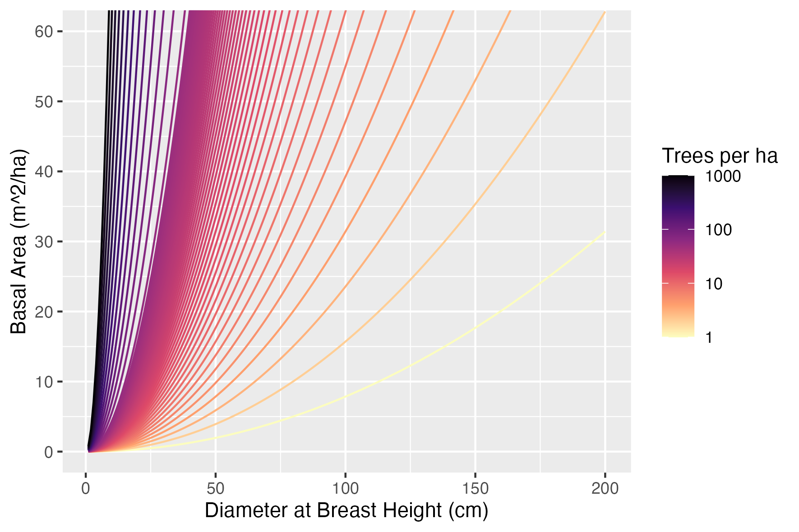
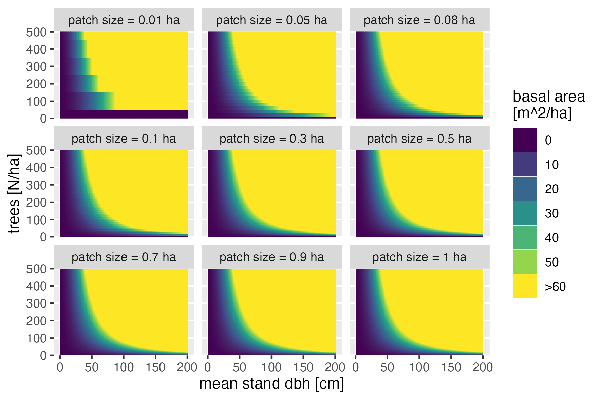

# Calculate the Basal Area of a Stand

This function calculates the basal area of a stand based on the diameter
at breast height (dbh), the number of trees, and the patch size in
hectares.

## Usage

``` r
BA_stand(dbh, trees, patch_size_ha)
```

## Arguments

- dbh:

  A torch tensor or numeric vector representing the diameter at breast
  height of the trees in centimeters.

- trees:

  A torch tensor or numeric vector representing the number of trees.

- patch_size_ha:

  A numeric value representing the size of the patch in hectares.

## Value

A numeric value representing the basal area of the stand in square
meters per hectare.

## Details

The basal area of a stand is the cross-sectional area of all trees in a
stand per unit area. This function calculates the basal area per ha
using the formula: \$\$BA = \left( \frac{\pi \left(
\frac{\text{dbh}}{100} \right)^2}{4} \right) \times \text{trees} \div
\text{patch\\size\\ha}\$\$

The formula takes into account the diameter at breast height (dbh) in
centimeters, the number of trees, and the size of the patch in hectares
to calculate the basal area in square meters per hectare.

This plot illustrates the basal area for different combinations of dbh
and number of trees.



Sensitivity of basal area for different combinations of dbh, number of
trees to patch size.



## Examples

``` r
# Example usage
dbh_vec <- seq(1, 200, 1)
trees_vec <- c(0:500, 10^(seq(2, 4, length.out = 20)))

# Generate test data for a patch size of 0.1
patch_size <- 0.1
cohort_df1 <- expand.grid(
  trees_ha = trees_vec,
  patch_size_ha = patch_size,
  dbh = dbh_vec
)

cohort_df1 <- data.frame(
  patchID = 1,
  cohortID = 1,
  species = 1,
  cohort_df1
)

cohort_df1$siteID <- 1:nrow(cohort_df1)
cohort_df1$trees <- round(cohort_df1$trees_ha * patch_size)

cohort <- CohortMat$new(obs_df = cohort_df1)

cohort_df1$basal_area <- torch::as_array(BA_stand(cohort$dbh, cohort$trees, patch_size_ha = patch_size))

# View the first few rows of the resulting data frame
head(cohort_df1)
#>   patchID cohortID species trees_ha patch_size_ha dbh siteID trees basal_area
#> 1       1        1       1        0           0.1   1      1     0          0
#> 2       1        1       1        1           0.1   1      2     0          0
#> 3       1        1       1        2           0.1   1      3     0          0
#> 4       1        1       1        3           0.1   1      4     0          0
#> 5       1        1       1        4           0.1   1      5     0          0
#> 6       1        1       1        5           0.1   1      6     0          0

# Basic plot showing the function of trees and dbh for basal area

# only keep rows with basal area <100
cohort_df1 <- cohort_df1[cohort_df1$basal_area < 100,]

library(ggplot2)
ggplot(cohort_df1, aes(x = dbh, y = basal_area, color = trees, group = trees)) +
  geom_line() +
  ylab("Basal Area (m^2/ha)") +
  xlab("Diameter at Breast Height (cm)") +
  scale_color_viridis_c(name = "Trees per ha", trans = "log10", option = "magma", direction = -1) +
  ggtitle("Basal Area as a Function of Trees and DBH")
#> Warning: log-10 transformation introduced infinite values.
```
