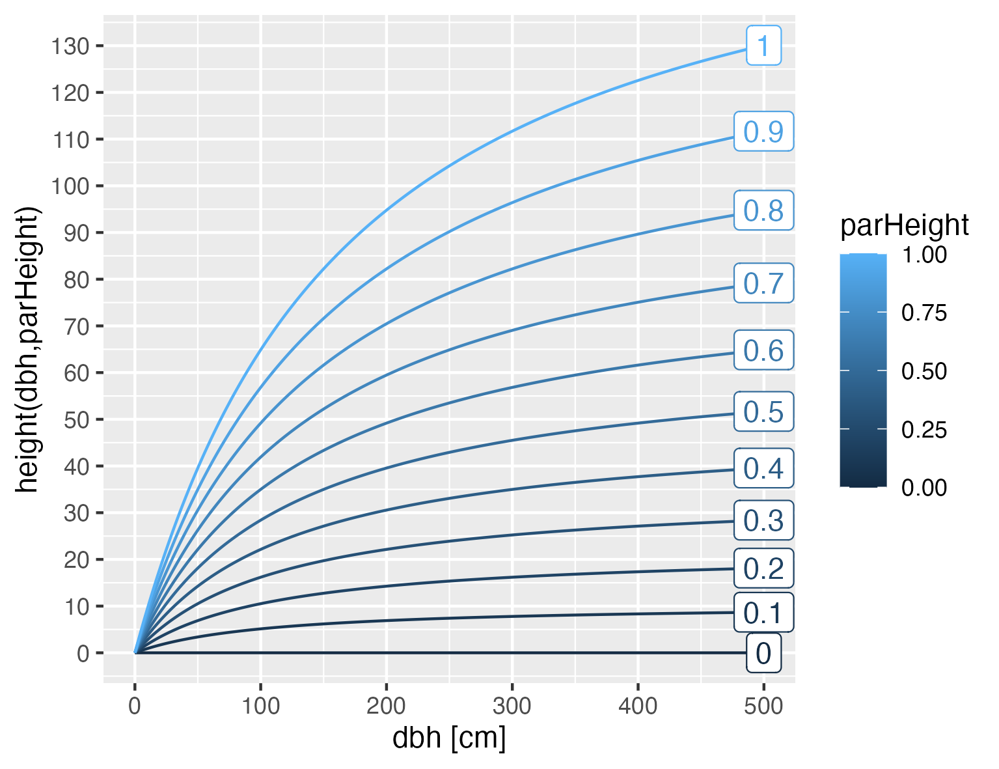

# Calculate the height of a tree based on its diameter at breast height and an allometry parameter.

Calculate the height of a tree based on its diameter at breast height
and an allometry parameter.

## Usage

``` r
height(dbh, parHeight)
```

## Arguments

- dbh:

  A numeric value representing the diameter at breast height of the tree
  in cm.

- parHeight:

  A numeric value representing the species height allometry.

## Value

A numeric value representing the calculated height of the tree.

## Details

This function calculates the height of a tree based on the diameter at
breast height (dbh) and a parameter parHeight.

The height is calculated using the formula: \$\$height = \left( \exp
\left( \frac{(\text{dbh} \times \text{parHeight})}{(\text{dbh} + 100)}
\right) - 1 \right) \times 100 + 0.001\$\$ where dbh is the diameter at
breast height of the tree in cm and parHeight is an allometric species
specific parameter.

All parameters of parHeight from 0 to 1 result in physiologicaly
plausible heights. The range from 0.3 to 0.9 results in realistic tree
heights. Values of parHeight close to 1 are physiologically almost
impossible, below 0.3 is suitable for small tree species and shrubs.



## Examples

``` r
height(30, 0.5)
#> [1] 12.2315
height(c(30), c(0.5,0.3))
#> [1] 12.231501  7.169349
height(c(30,20), c(0.5))
#> [1] 12.231501  8.691405
```
