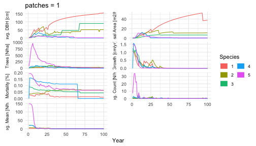
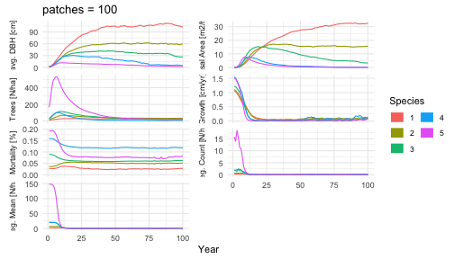

FINN is an R-package of a forest gap model that seamlessly integrates with neural networks. The package provides various functions that allow the user to customize the model from a mechanistic forest gap model to a mostly data-driven neural network. Individual processes can be replaced by neural networks and custom functions can be incorporated, or a combination of both. The package is designed to be user-friendly and flexible, allowing users to easily modify the model.

# Installation

The development version of FINN can be installed from GitHub. Currently we are in an early stage of development and the package is not yet available on CRAN. If you encounter problems running the code or understanding the documentation, please let us know by opening an issue on the [GitHub repository](https://github.com/FINNverse/FINN).


``` r
devtools::install_github("https://github.com/FINNverse/FINN")
```

# Run the model

Load the package and setup some basic simulation parameters.


``` r
library(FINN)
library(data.table)
library(ggplot2)

Ntimesteps = 500  # number of timesteps
Nsites = 1 # number of sites
patch_size = 0.1
# one species
Nsp = 5 # number of species
```

## Species parameters

The user can specify the species parameters. For each process species parameters are stored in vectors or matrices with rows representing species and columns representing different parameters. There are two kinds of parameters 1) process parameters like light requirements and effect of size (DBH) on a process. 2) Environmental parameters that modulate the effect of the environment on a process. Environmental parameters also include an intercept that modulates the overall effect size of a process.

The following code generates random species parameters for a simple model with 10 species and 1 environmental variable.


``` r
FINN.seed(1234)
# we draw the same shade parameters for each process for simplicity
# shade parameters correspond to the fraction of light a species needs to succesfully grow, regenerate, or survive.
shadeSP = c(0.1,0.2,0.5,0.5,0.7)

# regeneration parameters
parReg = shadeSP # regeneration is only dependent on shade and environment
parRegEnv = list(matrix(c(
  c(1,2,3,3,5), # intercept regulating the overall effect size
  runif(Nsp, -2, 2) # the second parameter modulates the effect of the environmental variable
  ),Nsp, 2))

# growth parameters
parGrowth = matrix(c(
  shadeSP, # see above
  c(0.04,0.05,0.05,0.06,0.1) # the second growth parameter modulates the size dependent growth
  ),Nsp, 2)

parGrowthEnv = list(matrix(c(
  c(0.2,0.3,0.5,1,1)*0.5, # intercept regulating the overall effect size
  runif(Nsp, -2, -0.5) # the second parameter modulates the effect of the environmental variable
  ),Nsp, 2))

# mortality parameters
parMort = matrix(c(
  as.numeric(scale(shadeSP)), # see above
  as.numeric(scale(parGrowth[,2])), # the second growth parameter modulates the size dependent mortality
  rep(0,Nsp) # the third mort parameter modulates the growth dependent mortality
  ),Nsp, 3)
parMortEnv = list(matrix(c(
  runif(Nsp, -3, -2), # intercept regulating the overall effect size
  runif(Nsp, -3, -2) # the second parameter modulates the effect of the environmental variable
  ), Nsp, 2))

# allometric parameters for the calculation of tree height from a trees diameter
parComp = matrix(c(
  c(0.5,0.5,0.4,0.7,0.6), # parHeight
  c(0.3,0.2,0.2,0.2,0.1) # Competition strength
),Nsp, 2)

# Create a wide-format data.table with one row per species
pars_dt <- data.table(
  speciesID   = 1:Nsp,
  reg         = parReg,
  growth1      = parGrowth[, 1],
  growth2      = parGrowth[, 2],
  mort1        = parMort[, 1],
  mort2        = parMort[, 2],
  mort3        = parMort[, 3],
  compHeight  = parComp[, 1],
  compStrength= parComp[, 2],
  regEnv1     = sapply(parRegEnv, function(x) x[1, 1]),
  regEnv2     = sapply(parRegEnv, function(x) x[1, 2]),
  growthEnv1  = sapply(parGrowthEnv, function(x) x[1, 1]),
  growthEnv2  = sapply(parGrowthEnv, function(x) x[1, 2]),
  mortEnv1    = sapply(parMortEnv, function(x) x[1, 1]),
  mortEnv2    = sapply(parMortEnv, function(x) x[1, 2])
)
pars_dt
#>    speciesID   reg growth1 growth2      mort1         mort2 mort3 compHeight
#>        <int> <num>   <num>   <num>      <num>         <num> <num>      <num>
#> 1:         1   0.1     0.1    0.04 -1.2247449 -8.528029e-01     0        0.5
#> 2:         2   0.2     0.2    0.05 -0.8164966 -4.264014e-01     0        0.5
#> 3:         3   0.5     0.5    0.05  0.4082483 -4.264014e-01     0        0.4
#> 4:         4   0.5     0.5    0.06  0.4082483 -5.917509e-16     0        0.7
#> 5:         5   0.7     0.7    0.10  1.2247449  1.705606e+00     0        0.6
#>    compStrength regEnv1   regEnv2 growthEnv1 growthEnv2  mortEnv1  mortEnv2
#>           <num>   <num>     <num>      <num>      <num>     <num>     <num>
#> 1:          0.3       1 -1.545186        0.1  -1.039534 -2.306409 -2.162704
#> 2:          0.2       1 -1.545186        0.1  -1.039534 -2.306409 -2.162704
#> 3:          0.2       1 -1.545186        0.1  -1.039534 -2.306409 -2.162704
#> 4:          0.2       1 -1.545186        0.1  -1.039534 -2.306409 -2.162704
#> 5:          0.1       1 -1.545186        0.1  -1.039534 -2.306409 -2.162704
```

## Environment and disturbances

Next we have to specify the environmental input variables. These variables are used to calculate the effect of the environment on the processes. The environmental variables are supplied with a data.frame/data.table in a long format with the columns siteID and year and the environmental variables as additional columns.


``` r
# we first generate a data.table with all combinations of site and timestep.
env_dt <- data.table(
  expand.grid(
    list(
      siteID = 1:Nsites,
      year = 1:Ntimesteps
    )
  )
)

dist_dt <- env_dt

# for this very simple model we will have a constant environment for all sites and timesteps
env_dt$env1 = rep(0, Ntimesteps)

# we can also specify the intensity of disturbances for each timestep

# here we specify a disturbance frequency of 5%, which means that there is a 5% chance each year that a disturbance occurs
disturbance_frequency = 0.05

# the disturbance intensity at each timestep is the fraction of patches that is disturbed at that time step
disturbance_intensity = rbinom(Ntimesteps*Nsites,1,0.2)*runif(Ntimesteps*Nsites, 0.5, 1)

# this will result in 0 to 20 % of the patches being disturbed at each timestep
dist_dt$intensity = rbinom(Ntimesteps*Nsites, 1, disturbance_frequency)*disturbance_intensity
```

## Simulate

The model can be run with the `simulateForest` function. Its arguments are `env` which is the environmental input data.table, `patches` the number of patches, and the processes.

The processes are specified with the `createProcess` function. The first argument is a formula that specifies the relation between environment and the process. The formula includes the intercept and the environmental variables that are provided with `env`. The second argument is the function that should be used for the process. FINN includes the default functions `growth`, `mortality`, and `regeneration`. The user can also provide custom functions. The function should take the species parameters and the environmental parameters as arguments. The third and fourth arguments are the initial species and environmental parameters.

Disturbances can be specified with the `disturbance` argument, which requires a data.table with the columns siteID, year, and intensity. The intensity is the fraction of patches that are disturbed at that timestep.

The effect of environmental variable supplied with the environmental data can be defined in the process functions. For example `~ 1 + env1` specifies an intercept and a linear effect of env1. Both, the intercept `1` and the effect of `env1` can be modulated by the species parameters that were specified above.


``` r
predictions <- list()
simulationModel = finn(N_species = Nsp,
  competition_process = createProcess(~0, func = FINN::competition),
  growth_process = createProcess(~1+env1, initEnv = parGrowthEnv,initSpecies = parGrowth, func = FINN::growth),
  regeneration_process = createProcess(~1+env1, initEnv = parRegEnv,initSpecies = parReg, func = FINN::regeneration),
  mortality_process = createProcess(~1+env1, initEnv = parMortEnv,initSpecies = parMort, func = FINN::mortality),
)

predictions[["patches_1"]] =
  simulateForest(simulationModel, init_cohort = NULL, env = env_dt, disturbance = dist_dt, device = "cpu", patches = 1)

simulationModel = finn(N_species = Nsp,
  competition_process = createProcess(~0, func = FINN::competition),
  growth_process = createProcess(~1+env1, initEnv = parGrowthEnv,initSpecies = parGrowth, func = FINN::growth),
  regeneration_process = createProcess(~1+env1, initEnv = parRegEnv,initSpecies = parReg, func = FINN::regeneration),
  mortality_process = createProcess(~1+env1, initEnv = parMortEnv,initSpecies = parMort, func = FINN::mortality),
)

predictions[["patches_100"]] =
  simulateForest(simulationModel, init_cohort = NULL, env = env_dt, disturbance = dist_dt, device = "cpu", patches = 100)
```

Simulating a single patch is noisy — a gap model's dynamics are stochastic, so
one patch is one realisation. Averaging over many patches recovers the smooth
stand-level expectation:


``` r
for(i in c("patches_1", "patches_100")){
  p_dat <- predictions[[i]]$long$site[, .(value = mean(value)), by = .(year, species, variable)]
  p_dat[, variable2 := factor(
    variable,
    levels = c("dbh", "ba", "trees", "AL", "growth", "mort", "reg", "r_mean_ha"),
    labels =  c("avg. DBH [cm]", "Basal Area [m2/ha]", "Trees [N/ha]",
                "Available Light [%]", "Growth [cm/yr]", "Mortality [%]",
                "Reg. Count [N/ha]", "Reg. Mean [N/ha]")
    ),]
  p_dat[variable %in% c("ba", "trees"), value := value/patch_size,]
  p <- ggplot(p_dat[year <= 100], aes(x = year, y = value, color = factor(species))) +
  geom_line() +
  theme_minimal() +
  labs(x = "Year", y = "Value") +
  coord_cartesian(ylim = c(0, NA)) +
  facet_wrap(~variable2, scales = "free_y", ncol = 2, strip.position = "left") +
  theme(
    axis.title.y = element_blank(),
    strip.placement = "outside",
    strip.text.y.left = element_text(angle = 90)
  ) +
  guides(color = guide_legend(title = "Species", override.aes = list(linewidth = 5), ncol = 2, title.position = "top")) +
  scale_color_discrete(name = "Species") +
  ggtitle(paste0("patches = ",gsub("patches_", "", i)))

  print(p)
}
```




``` r
sessionInfo()
#> R version 4.5.0 (2025-04-11)
#> Platform: aarch64-apple-darwin20
#> Running under: macOS 26.5.1
#> 
#> Matrix products: default
#> BLAS:   /Library/Frameworks/R.framework/Versions/4.5-arm64/Resources/lib/libRblas.0.dylib 
#> LAPACK: /Library/Frameworks/R.framework/Versions/4.5-arm64/Resources/lib/libRlapack.dylib;  LAPACK version 3.12.1
#> 
#> locale:
#> [1] C
#> 
#> time zone: Europe/Berlin
#> tzcode source: internal
#> 
#> attached base packages:
#> [1] stats     graphics  grDevices utils     datasets  methods   base     
#> 
#> other attached packages:
#> [1] ggplot2_3.5.2     data.table_1.17.8 FINN_0.1.0       
#> 
#> loaded via a namespace (and not attached):
#>  [1] vctrs_0.6.5        cli_3.6.6          knitr_1.50         rlang_1.2.0       
#>  [5] xfun_0.57          processx_3.8.6     generics_0.1.4     torch_0.15.1      
#>  [9] coro_1.1.0         labeling_0.4.3     glue_1.8.0         bit_4.6.0         
#> [13] ps_1.9.1           scales_1.4.0       grid_4.5.0         evaluate_1.0.5    
#> [17] tibble_3.3.0       lifecycle_1.0.5    compiler_4.5.0     dplyr_1.1.4       
#> [21] RColorBrewer_1.1-3 Rcpp_1.1.0         pkgconfig_2.0.3    farver_2.1.2      
#> [25] R6_2.6.1           tidyselect_1.2.1   pillar_1.11.0      callr_3.7.6       
#> [29] magrittr_2.0.3     withr_3.0.2        tools_4.5.0        bit64_4.6.0-1     
#> [33] gtable_0.3.6
```
