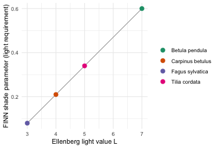
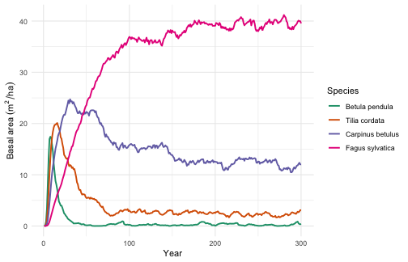
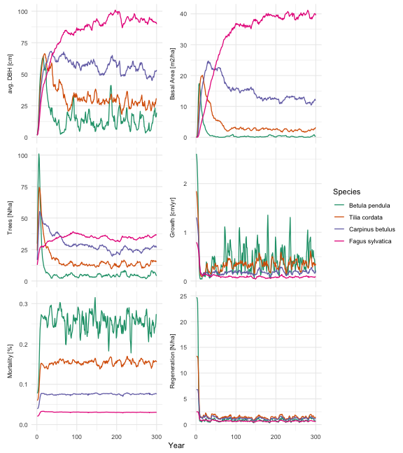
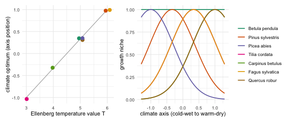
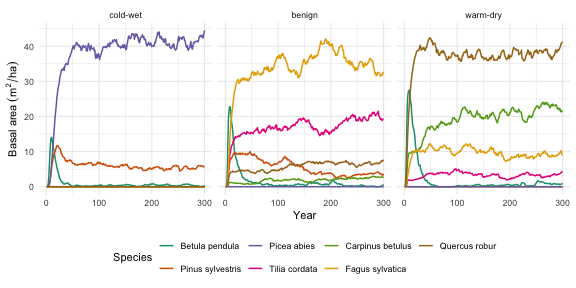

FINN simulates forest succession as the interplay of regeneration,
growth, mortality and competition as ecological processes. Here we give
it four species with contrasting life-history strategies derived from
Ellenberg values and let it simulate succession from bare ground to show
that FINN provides that structure to translate Ellenberg indicator
values into a plausible succession trajectory. This is the traditional
way of dynamic forest modeling introduced by Botkin et al. (1972). No
data, no fitting.


``` r
library(FINN)
library(data.table)
library(ggplot2)
FINN.seed(1234)

Ntimesteps <- 300
Nsites     <- 1
Nsp        <- 4          # pioneer -> early-mid -> mid-late -> climax
patch_size <- 0.1
```

## The species and their trade-offs

We use four well-known European tree species along a life-history
gradient, from the fast, light-demanding **pioneer** *Betula pendula*
(silver birch) to the slow, shade-tolerant **climax** *Fagus sylvatica*
(beech), with *Tilia cordata* (small-leaved lime) and *Carpinus betulus*
(hornbeam) in between. Every parameter below specifies one end of a
trade-off along this gradient.

A key species property in forest succession is shade tolerance (the
**shade parameter**, `parGrowth[,1]` and `parReg`). In FINN this is the
fraction of light a species needs to grow and regenerate. A **high**
value therefore means *light-demanding* (a pioneer that needs open
ground) and a **low** value means *shade-tolerant* (a climax species
that establishes under a closed canopy). We derive it from each species'
Ellenberg light-indicator value L rescaled into a range that is
compatible with FINN. Ellenberg L describes a species' realised light
niche, which we use here as a convenient proxy for shade tolerance
(Ellenberg et al. 1991; for a more rigorous, continuous shade-tolerance
scale see Niinemets and Valladares 2006).


``` r
# Four well-known European species along a light-tolerance gradient. Each has an
# Ellenberg light-indicator value L (1 = deep shade ... 9 = full light); we
# rescale L into the shade parameter so shade tolerance comes from the indicator value
species     <- c("Betula pendula", "Tilia cordata", "Carpinus betulus", "Fagus sylvatica")
ellenberg_L <- c(7, 5, 4, 3)   # birch (pioneer) ... beech (climax)

# shade = light fraction a species needs to grow / regenerate.
#   high -> light-demanding (birch); low -> shade-tolerant (beech)
shadeSP <- 0.08 + (0.60 - 0.08) *
  (ellenberg_L - min(ellenberg_L)) / (max(ellenberg_L) - min(ellenberg_L))
# -> 0.60 birch, 0.34 lime, 0.21 hornbeam, 0.08 beech

# Only `shade` is read from an indicator value. The parameters below are not from
# Ellenberg: they are illustrative life-history values, each encoding one
# pioneer <-> climax trade-off (fast, short-lived, prolific vs slow, long-lived,
# sparse). The comments give the reasoning; the exact magnitudes are not critical.

# --- regeneration ----------------------------------------------------------
# reg light threshold = shade tolerance; the intercept is relative seed rain,
# higher for the pioneer (many small wind seeds) than the climax (fewer, masting).
parReg    <- shadeSP
parRegEnv <- matrix(c(
  c(3.2, 2.6, 2.0, 1.2),   # intercept: relative seed rain, pioneer -> climax
  rep(0, Nsp)              # env slope = 0 (the environment is held constant here)
), Nsp, 2)

# --- growth ----------------------------------------------------------------
# col 1 = shade threshold (as above). col 2 = size-dependent growth decay: growth
# carries a factor exp(-col2 * dbh), so relative growth fades as a tree gets big.
# Higher for the pioneer (fast when young, then fades) than the climax (sustains).
parGrowth <- matrix(c(
  shadeSP,
  c(0.040, 0.038, 0.034, 0.030)
), Nsp, 2)
# growth-rate intercept: the pioneer grows ~4x faster than the climax, so it
# seizes the early canopy; the climax builds slowly.
parGrowthEnv <- matrix(c(
  c(1.00, 0.65, 0.30, -0.20),
  rep(0, Nsp)
), Nsp, 2)

# --- mortality -------------------------------------------------------------
# Mortality is mort = plogis(intercept + col1*light + col3*growth), so it
# changes through the run as light and growth change:
#   col1 (light): negative -> mortality RISES as a cohort is overtopped (low
#                 light). Steep for the pioneer (shade-intolerant), ~flat for
#                 the climax (shade-tolerant).
#   col3 (growth): negative -> suppressed, slow-growing trees die more (vigour).
#   col2 (dbh): left 0.
parMort <- matrix(c(
  c(-1.0, -0.8, -0.5, -0.3),   # col1 light: pioneer strongly shade-intolerant
  rep(0, Nsp),                 # col2 dbh: off
  c(-0.3, -0.3, -0.3, -0.3)    # col3 growth: vigour lowers mortality
), Nsp, 3)
# baseline mortality ~ inverse longevity: high for the short-lived pioneer,
# low for the long-lived climax.
parMortEnv <- matrix(c(
  c(-0.69, -1.40, -2.30, -3.30),  # intercept: per-species baseline
  rep(0, Nsp)                     # env slope = 0
), Nsp, 2)

# --- competition -----------------------------------------------------------
# col 1 = height allometry (maximum stature): beech is tallest and overtops late,
# hornbeam is a sub-canopy tree and stays short. col 2 = competition strength (how
# strongly a cohort shades its neighbours); illustrative, mild pioneer -> climax gradient.
parComp <- matrix(c(
  c(0.55, 0.60, 0.48, 0.68),   # birch, lime, hornbeam (sub-canopy), beech
  c(0.30, 0.25, 0.20, 0.15)
), Nsp, 2)
```

We can gain an overview of the parameters in a table:


``` r
pars_dt <- data.table(
  species       = species,
  ellenberg_L   = ellenberg_L,
  shade         = round(shadeSP, 2),
  growth_rate   = round(exp(parGrowthEnv[, 1]), 2),   # relative growth speed
  mort_shaded   = round(plogis(parMortEnv[, 1]), 3),  # mortality when overtopped (light~0)
  shade_intol   = -parMort[, 1],                      # how much mortality rises in shade
  seed_rain     = round(exp(parRegEnv[, 1]), 1),      # relative fecundity
  height_allom  = parComp[, 1]
)
pars_dt
#>             species ellenberg_L shade growth_rate mort_shaded shade_intol
#>              <char>       <num> <num>       <num>       <num>       <num>
#> 1:   Betula pendula           7  0.60        2.72       0.334         1.0
#> 2:    Tilia cordata           5  0.34        1.92       0.198         0.8
#> 3: Carpinus betulus           4  0.21        1.35       0.091         0.5
#> 4:  Fagus sylvatica           3  0.08        0.82       0.036         0.3
#>    seed_rain height_allom
#>        <num>        <num>
#> 1:      24.5         0.55
#> 2:      13.5         0.60
#> 3:       7.4         0.48
#> 4:       3.3         0.68
```

Reading the rows: the pioneer needs the most light (`shade` 0.60), grows
fastest (`growth_rate` ≈ 2.7), is the most shade-intolerant
(`shade_intol` highest, so its mortality climbs steeply once overtopped
— `mort_shaded` ≈ 0.33) and regenerates most (`seed_rain`); the climax is
shade-tolerant, slow, almost immortal even in deep shade
(`mort_shaded` ≈ 0.035), sparse but steady, and the tallest, so it
ultimately overtops.

The `shade` parameter is not guessed, it is a straight rescaling of the
Ellenberg light value L. A light-demanding species (high L) needs a high
fraction of full light, a shade-tolerant species (low L) tolerates deep
shade. Other parameters are based on basic ecological understanding (see comments in the code).

<div class="figure" style="text-align: center">

<p class="caption">Ellenberg light value L mapped to the FINN shade parameter. The line is the rescaling; the points are our four species.</p>
</div>

## Simulate succession

In this example we simulate under constant environment (`env1 = 0`), so succession here comes
purely from the demographic trade-offs. We run from bare ground with no
disturbance. We will explore the implications of adding an environmental gradient in the next section.


``` r
env_dt <- data.table(expand.grid(siteID = 1:Nsites, year = 1:Ntimesteps))
env_dt$env1 <- 0

m <- finn(
  N_species            = Nsp,
  competition_process  = createProcess(~0,      FINN::competition),
  growth_process       = createProcess(~1+env1, FINN::growth,       initSpecies = parGrowth, initEnv = parGrowthEnv),
  regeneration_process = createProcess(~1+env1, FINN::regeneration, initSpecies = parReg,    initEnv = parRegEnv),
  mortality_process    = createProcess(~1+env1, FINN::mortality,    initSpecies = parMort,   initEnv = parMortEnv)
)

sim <- predict(m, init_cohort = NULL, env = env_dt, disturbance = NULL,
               patches = 100, device = "cpu")

# average over patches; convert per-patch ba/trees to per-hectare
p_dat <- sim$long$site[, .(value = mean(value)), by = .(year, species, variable)]
p_dat[variable %in% c("ba", "trees"), value := value / patch_size]

sp_labs <- species   # Betula, Tilia, Carpinus, Fagus (pioneer -> climax)
```

## The successional pattern


``` r
ba <- p_dat[variable == "ba"]
ggplot(ba, aes(year, value, colour = factor(species))) +
  geom_line(linewidth = 0.9) +
  scale_colour_brewer(palette = "Dark2", name = "Species", labels = sp_labs) +
  labs(x = "Year", y = expression(Basal~area~(m^2/ha))) +
  theme_minimal()
```

<div class="figure" style="text-align: center">

<p class="caption">Basal area by species over time. The pioneer peaks within the first decade and collapses; mid-seral species crest in turn; the shade-tolerant climax rises slowly and dominates the mature stand.</p>
</div>

The same run, across every state variable FINN tracks — diameter, basal
area, tree numbers, growth, mortality and regeneration:


``` r
panel <- copy(p_dat)
# regeneration is shown as the mean per hectare (r_mean_ha); the per-patch
# count (reg) is dropped.
panel[, variable2 := factor(
  variable,
  levels = c("dbh", "ba", "trees", "AL", "growth", "mort", "r_mean_ha"),
  labels = c("avg. DBH [cm]", "Basal Area [m2/ha]", "Trees [N/ha]",
             "Available Light [%]", "Growth [cm/yr]", "Mortality [%]",
             "Regeneration [N/ha]"))]
ggplot(panel[!is.na(variable2)], aes(year, value, colour = factor(species))) +
  geom_line(linewidth = 0.6) +
  facet_wrap(~variable2, scales = "free_y", ncol = 2, strip.position = "left") +
  coord_cartesian(ylim = c(0, NA)) +
  scale_colour_brewer(palette = "Dark2", name = "Species", labels = sp_labs) +
  labs(x = "Year", y = NULL) +
  theme_minimal() +
  theme(strip.placement = "outside",
        strip.text.y.left = element_text(angle = 90),
        axis.title.y = element_blank())
```

<div class="figure" style="text-align: center">

<p class="caption">Succession across all FINN state variables for the four species.</p>
</div>

## What just happened

The figures showed classic expected successional patterns that are simulated by many dynamic forest models, 
and every feature maps back to a parameter choice we made earlier:

- **The pioneer (birch) erupts and collapses.** On open ground light is
  abundant, so its high light requirement is met; its fast growth and
  high regeneration let it dominate the canopy within the first decade. But
  as the canopy closes, light drops below its high `shade` threshold and
  it can no longer regenerate because it is shade-intolerant. Its
  mortality increases rapidly once overtopped (visible in the mortality
  panel: from \~0.08 yr⁻¹ in full light to \~0.3 yr⁻¹ in shade),
  clearing the standing trees. By mid-succession it is essentially gone.
- **Each mid-successional species has its turn.** Lime and hornbeam have
  progressively lower light requirements and lower mortality, so each
  peaks a little later and stays a little longer. Hornbeam holds a
  stable subdominant presence through the middle of the run.
- **The climax (beech) dominates the stand.** It grows slowly and regenerates
  sparsely, so early on it is barely visible. But it regenerates under
  shade (lowest `shade`), is shade-tolerant so it barely dies even when
  overtopped (mortality stays \~0.02–0.03 yr⁻¹ throughout), and is the
  tallest (highest `height_allom`). So once the early- and mid-successional canopy
  disappears it overtopps and dominates the mature forest.

This is an emergent pattern resulting from the parameters that encode demographic trade-offs for four
species and FINN providing the structure to create the successional turnover.

## Adding a climate gradient

So far we ignored the environment. We now add a climate gradient
to let FINN differentiate between species environmental niche. The gradient `env1` runs from a cold and wet site at
`-1`, through a benign site, to a warm and dry site at `+1`, so
temperature and drought increase together along one axis. We keep the birch
pioneer and add six species that each prefer a different position on the
axis, the boreal conifers *Picea abies* and *Pinus sylvestris*, the
temperate broadleaves *Tilia cordata*, *Carpinus betulus* and *Fagus
sylvatica*, and the warm-dry *Quercus robur*.

Each species carries an Ellenberg temperature value (`ellenberg_T` in the code),
which we rescale exactly as we rescaled L for shade into a climate optimum
(`t_opt`), its preferred position on the cold-wet to warm-dry axis. Growth peaks
at `t_opt` and mortality is lowest there and rises as a site moves away from it,
so a species grows and survives well only where the climate suits it. The
constants `k` and `km` set how quickly growth and survival fall off away from the
optimum.

In addition two other terms act on every species at once rather than on its own optimum.
`g_prod` makes warmer sites more productive and `h_cold` makes the cold-wet end
harsher, so overall growth and survival decline toward the cold. Without them each
species at its own optimum would do equally well and the boreal site would be as
dense as the warm one; with them the boreal stand stays realistically sparse.


``` r
#                birch   pine   spruce   lime   hornbeam  beech   oak
species_T   <- c("Betula pendula", "Pinus sylvestris", "Picea abies", "Tilia cordata",
                 "Carpinus betulus", "Fagus sylvatica", "Quercus robur")
ellenberg_T <- c( 5,      4,      3,       5,      6,       5,      6)  # cold 1 ... warm 9 (birch indifferent)
Nsp_T       <- length(species_T)

# Only the climate optimum is derived from an indicator value: rescale Ellenberg T
# to a position on the axis [-1, 1]. Everything else below is illustrative.
t_opt <- 2 * (ellenberg_T - min(ellenberg_T)) / (max(ellenberg_T) - min(ellenberg_T)) - 1

# Per-species life-history speed and baseline mortality: birch grows fastest and
# is the shortest-lived (pioneer); the rest are slower and long-lived. Oak is the
# fastest climax so it can seize the warm-dry canopy before hornbeam fills in.
base_g <- c(1.00, 0.70, 0.25, 0.28, 0.25, 0.36, 0.55)   # growth speed at the optimum
m_opt  <- c(-0.7, -2.5, -2.5, -2.5, -2.5, -2.5, -2.5)   # baseline mortality at the optimum

# Shared climate effects. Magnitudes are tuned so the matched species clearly wins
# each site and the cold-wet stand stays realistically sparse, not fitted to data.
k <- 1.0;  g_prod <- 0.40   # growth: width of the optimum, and warmer = more productive
km <- 0.9; h_cold <- 0.45   # mortality: penalty for climatic mismatch, and cold-wet harshness

# Each species gets a hump-shaped climate response: growth peaks at its optimum
# t_opt, mortality is lowest there and rises with mismatch. Written as
# intercept + b1*env1 + b2*env1^2 (the columns of the env-parameter matrix).
parGrowthEnv_T <- cbind(base_g - k  * t_opt^2,  2 * k  * t_opt + g_prod, rep(-k,  Nsp_T))
parMortEnv_T   <- cbind(m_opt  + km * t_opt^2, -2 * km * t_opt - h_cold, rep( km, Nsp_T))

# Birch is the exception. It is a fast, short-lived, light-demanding generalist
# that pioneers every site, so it has no climate optimum: flat growth and
# mortality, with only the shared warmth/harshness terms and no env1^2 curvature.
birch <- match("Betula pendula", species_T)
parGrowthEnv_T[birch, ] <- c(base_g[birch],  g_prod, 0)
parMortEnv_T[birch, ]   <- c(m_opt[birch],  -h_cold, 0)

# shade tolerance and the other traits from autecology (birch light-demanding,
# spruce and beech tolerant, oak and pine more light-demanding, hornbeam sub-canopy)
shade_T     <- c(0.60, 0.45, 0.13, 0.24, 0.15, 0.10, 0.30)
parGrowth_T <- cbind(shade_T, c(0.040, 0.038, 0.030, 0.034, 0.032, 0.030, 0.036))
parReg_T    <- shade_T
parRegEnv_T <- matrix(c(3.4, 3.0, 2.4, 2.4, 2.2, 2.2, 2.6), Nsp_T, 1)
parMort_T   <- cbind(c(-1.0, -0.9, -0.3, -0.5, -0.35, -0.3, -0.7), rep(0, Nsp_T), rep(-0.3, Nsp_T))
parComp_T   <- cbind(c(0.55, 0.64, 0.66, 0.58, 0.45, 0.66, 0.66), c(0.30, 0.28, 0.16, 0.22, 0.20, 0.15, 0.20))

m_T <- finn(
  N_species            = Nsp_T,
  competition_process  = createProcess(~0,           FINN::competition, initSpecies = parComp_T),
  growth_process       = createProcess(~1+env1+env2, FINN::growth,       initSpecies = parGrowth_T, initEnv = parGrowthEnv_T),
  regeneration_process = createProcess(~1,           FINN::regeneration, initSpecies = parReg_T,    initEnv = parRegEnv_T),
  mortality_process    = createProcess(~1+env1+env2, FINN::mortality,    initSpecies = parMort_T,   initEnv = parMortEnv_T)
)
```

The two steps behind this are worth seeing directly. First each species'
Ellenberg T is rescaled to an optimum position on the axis, then that
optimum becomes a bell-shaped growth niche. Birch has no optimum and
stays flat, the generalist that pioneers every site.

<div class="figure" style="text-align: center">

<p class="caption">Left: Ellenberg temperature value T mapped to each species' climate optimum. Right: the resulting growth niche along the cold-wet to warm-dry axis, a bell peaking at the optimum (birch stays flat).</p>
</div>

We run this pool on three sites along the gradient and show the
basal-area succession side by side.


``` r
site_temp <- c(`cold-wet` = -1, benign = 0.33, `warm-dry` = 1)
runs <- rbindlist(lapply(names(site_temp), function(nm) {
  tt <- site_temp[[nm]]
  env_dt <- data.table(expand.grid(siteID = 1:Nsites, year = 1:Ntimesteps))
  env_dt$env1 <- tt
  env_dt$env2 <- tt^2
  sim <- predict(m_T, init_cohort = NULL, env = env_dt, disturbance = NULL,
                 patches = 100, device = "cpu")
  ba <- sim$long$site[variable == "ba", .(value = mean(value) / patch_size),
                      by = .(year, species)]
  ba[, climate := factor(nm, levels = names(site_temp))]
  ba
}))

ggplot(runs, aes(year, value, colour = factor(species))) +
  geom_line(linewidth = 0.7) +
  facet_wrap(~climate, ncol = 3) +
  scale_colour_brewer(palette = "Dark2", name = "Species", labels = species_T) +
  labs(x = "Year", y = expression(Basal~area~(m^2/ha))) +
  guides(colour = guide_legend(nrow = 2)) +
  theme_minimal() +
  theme(legend.position = "bottom")
```

<div class="figure" style="text-align: center">

<p class="caption">The same species pool along a cold-wet to warm-dry climate gradient. A spruce and pine stand forms in the cold and wet, a beech-dominated mixed forest in the benign middle, and an oak and hornbeam wood in the warm and dry, each opened by the birch pioneer.</p>
</div>

One pioneer and six climate specialists, and FINN sorts them into three
recognisable forests, a spruce and pine stand in the cold and wet, a
beech-dominated mixed forest in the benign middle, and an oak and
hornbeam wood in the warm and dry, each still opened by the birch
pioneer.

## References

Ellenberg, H., Weber, H.E., Düll, R., Wirth, V., Werner, W. and
Paulißen, D. (1991) Zeigerwerte von Pflanzen in Mitteleuropa. *Scripta
Geobotanica* 18, 1–248.

Tichý, L., Axmanová, I., Dengler, J. *et al.* (2023) Ellenberg-type
indicator values for European vascular plant species. *Journal of
Vegetation Science* 34, e13168. <https://doi.org/10.1111/jvs.13168>

Niinemets, Ü. and Valladares, F. (2006) Tolerance to shade, drought, and
waterlogging of temperate Northern Hemisphere trees and shrubs.
*Ecological Monographs* 76(4), 521–547.
[https://doi.org/10.1890/0012-9615(2006)076[0521:TTSDAW]2.0.CO;2](https://doi.org/10.1890/0012-9615(2006)076%5B0521:TTSDAW%5D2.0.CO;2){.uri}


``` r
sessionInfo()
#> R version 4.5.0 (2025-04-11)
#> Platform: aarch64-apple-darwin20
#> Running under: macOS 26.5.1
#> 
#> Matrix products: default
#> BLAS:   /Library/Frameworks/R.framework/Versions/4.5-arm64/Resources/lib/libRblas.0.dylib 
#> LAPACK: /Library/Frameworks/R.framework/Versions/4.5-arm64/Resources/lib/libRlapack.dylib;  LAPACK version 3.12.1
#> 
#> locale:
#> [1] C
#> 
#> time zone: Europe/Berlin
#> tzcode source: internal
#> 
#> attached base packages:
#> [1] stats     graphics  grDevices utils     datasets  methods   base     
#> 
#> other attached packages:
#> [1] patchwork_1.3.0   ggplot2_3.5.2     data.table_1.17.8 FINN_0.1.0       
#> 
#> loaded via a namespace (and not attached):
#>  [1] vctrs_0.6.5        cli_3.6.6          knitr_1.50         rlang_1.2.0       
#>  [5] xfun_0.57          processx_3.8.6     generics_0.1.4     torch_0.15.1      
#>  [9] coro_1.1.0         labeling_0.4.3     glue_1.8.0         bit_4.6.0         
#> [13] ps_1.9.1           scales_1.4.0       grid_4.5.0         abind_1.4-8       
#> [17] evaluate_1.0.5     tibble_3.3.0       lifecycle_1.0.5    compiler_4.5.0    
#> [21] dplyr_1.1.4        RColorBrewer_1.1-3 Rcpp_1.1.0         pkgconfig_2.0.3   
#> [25] farver_2.1.2       R6_2.6.1           tidyselect_1.2.1   pillar_1.11.0     
#> [29] callr_3.7.6        magrittr_2.0.3     withr_3.0.2        tools_4.5.0       
#> [33] bit64_4.6.0-1      gtable_0.3.6
```
