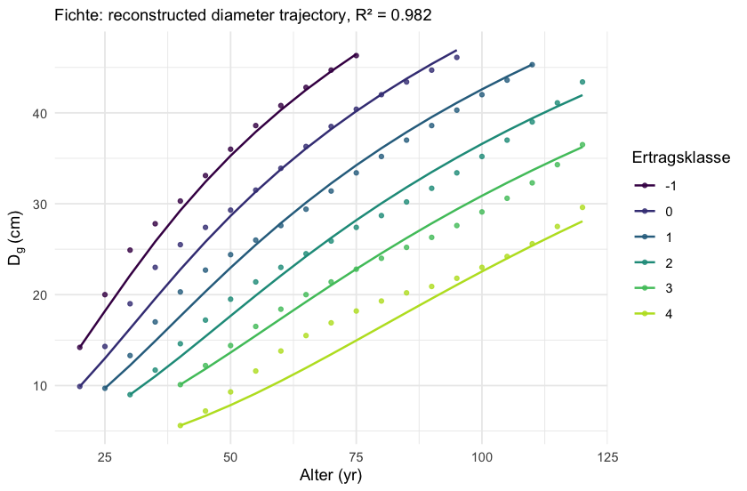
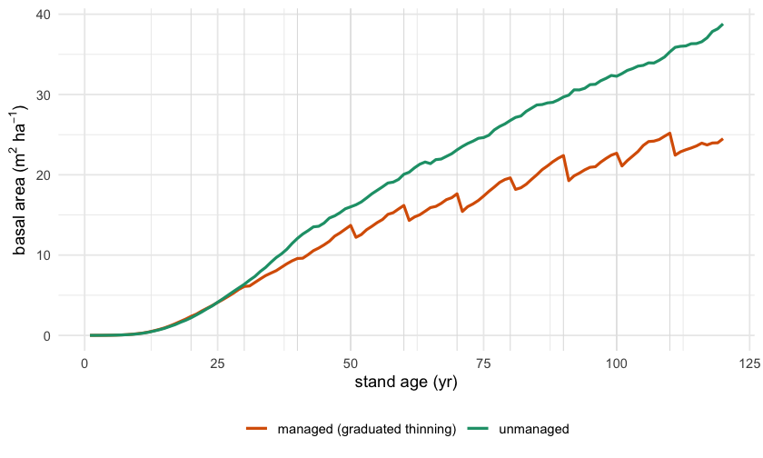

<!--
  PRECOMPILED. Edit THIS .Rmd.orig, then knit to G-Management_tool.Rmd under a
  UTF-8 locale (dev/precompile_G.R). Every figure is baked in; the shipped .Rmd
  re-runs nothing.
-->


Foresters already have excellent, authoritative decision aids: **yield tables** for
how a stand develops, **thinning guides** for how to tend it, and **development
types** for where to steer it. They are trusted — and *separate*. None lets you ask
a joined-up question across them, or calibrate to your own plot.

That is what FINN adds. Because it is **one differentiable, cohort-based model**, it
can be *fitted* to whatever data you have and can *combine* sources — growth from a
yield table, natural mortality from a monitoring plot, management from a
prescriptive rule — in a single simulation whose levers are written in the
vocabulary of the guides. This vignette shows the pieces and how they fit together.

## 1. Real growth, straight from a yield table

FINN ships the NW-FVA yield tables (Albert et al. 2021) for the five main species.
They are the empirical backbone for the **growth** process.


``` r
gy <- nwfva_yield_tables()
head(gy[gy$Art == "Fichte" & gy$Ekl == 1, c("Art","Ekl","Alter","N","Dg","G","Dg_aus")], 4)
#>        Art Ekl Alter    N   Dg    G Dg_aus
#> 463 Fichte   1    25 2211  9.7 16.4    7.8
#> 464 Fichte   1    30 1497 13.3 20.7    9.5
#> 465 Fichte   1    35 1083 17.0 24.5   11.7
#> 466 Fichte   1    40  863 20.3 27.8   15.3
```

FINN's growth law is `g = exp(env) * exp(-k * dbh)` — a relative diameter increment
that slows with size. We fit it to the tabulated diameter growth of one species
across yield classes (a linear fit in `log g`), then **integrate it forward** and
compare the reconstructed diameter trajectory to the table.


``` r
fd <- gy[gy$Art == "Fichte", ]
fd$g_obs <- fd$dDg_dt / fd$Dg
m_g <- lm(log(g_obs) ~ Ekl + Dg, data = fd[is.finite(fd$g_obs) & fd$g_obs > 0, ])
b0 <- coef(m_g)[[1]]; b1 <- coef(m_g)[["Ekl"]]; k <- -coef(m_g)[["Dg"]]

recon <- do.call(rbind, lapply(split(fd, fd$Ekl), function(s) {
  s <- s[order(s$Alter), ]; dbh <- s$Dg[1]; out <- numeric(nrow(s)); out[1] <- dbh
  for (i in 2:nrow(s)) {
    for (yr in seq_len(s$Alter[i] - s$Alter[i-1]))
      dbh <- dbh * (1 + exp(b0 + b1 * s$Ekl[1]) * exp(-k * dbh))
    out[i] <- dbh
  }
  data.frame(Ekl = factor(s$Ekl[1]), Alter = s$Alter, Dg_obs = s$Dg, Dg_fit = out)
}))
r2 <- 1 - sum((recon$Dg_obs - recon$Dg_fit)^2) / sum((recon$Dg_obs - mean(recon$Dg_obs))^2)

ggplot(recon, aes(Alter, colour = Ekl)) +
  geom_point(aes(y = Dg_obs), size = 1.1, alpha = .8) +
  geom_line(aes(y = Dg_fit), linewidth = .7) +
  scale_colour_viridis_d(option = "D", end = .9, name = "Ertragsklasse") +
  labs(x = "Alter (yr)", y = expression(D[g]~"(cm)"),
       subtitle = sprintf("Fichte: reconstructed diameter trajectory, R² = %.3f", r2))
```



The mechanistic form reproduces the real trajectories closely. FINN also offers
`growth_env()`, where the size-decline `k` itself responds to the environment (a
species baseline *combined* with site) — productive sites then grow faster **and**
sustain growth longer, which a single per-species `k` cannot capture.

## 2. Management in the language of the guides

FINN's management is **one continuous parameter set** — every strategy, including
each WET2024 development type, is a *point* in it, named in the WET vocabulary:


``` r
scheme <- management_params(
  target_diameter        = 50,   # Zielstärke (cm)
  target_harvest_fraction = 0.2, # Nutzungsstärke
  thinning_intensity     = 0.2,  # Durchforstungsstärke
  thinning_size_bias     = graduated_bias(from = -0.6, to = 0.8, ref = 50), # Durchforstungsart
  entry_interval_years   = 5)    # Eingriffsturnus
scheme
#> <management_params>  (one point in FINN's management genome)
#>   Zielstärke (target_diameter)      : 50 cm
#>   Nutzungsstärke (target_harvest)   : 0.2
#>   Zielstärken-Streubreite (spread)  : 5 cm
#>   Durchforstungsstärke (intensity)  : 0.2
#>   Durchforstungsart (size_bias)     : <function of stand>
#>   Mischungsregulierung (species)    : 0
#>   Verjüngung (planting_rate)        : 0
#>   Eingriffsturnus (interval, yr)    : 5
#>   Risikostufe (risk_level)          : 0
```

The `graduated_bias()` is the link to the FVA **Durchforstungshilfe** and the
NW-FVA graduated thinning: the removal shifts from *below* when the stand is young
to *above* as it matures. On a stand snapshot, the operator reports the diameter of
the trees it removes (`Dg_aus`) — directly comparable to a yield table's thinning:


``` r
young <- data.frame(siteID = 1L, patchID = 1L, cohortID = 1:4, species = 1L,
                    dbh = c(12, 18, 24, 30), trees = c(400, 250, 150, 60))
mature <- transform(young, dbh = c(30, 40, 48, 56))
c(young  = apply_management(young,  scheme)$Dg_aus_rel,   # < 1: from below
  mature = apply_management(mature, scheme)$Dg_aus_rel)   # > 1: from above
#>     young    mature 
#> 0.9824618 1.0646833
```

## 3. Simulate a managed stand

`simulate_managed()` threads a schedule through a fitted model: it simulates to each
entry, applies the prescription, re-initialises from the thinned state, and
continues — so the post-thinning light release and regrowth come from the model
itself. Here we contrast an unmanaged run with a graduated-thinning regime.


``` r
FINN.seed(1)
env <- data.table(expand.grid(siteID = 1:2, year = 1:120))[, climate := 0]
m <- finn(N_species = 1L,
  competition_process  = createProcess(~0, FINN::competition,  initSpecies = matrix(c(.25, .10), 1, 2)),
  growth_process       = createProcess(~1, FINN::growth,       initSpecies = matrix(c(.05, .05), 1, 2), initEnv = list(matrix(-1.0, 1, 1))),
  regeneration_process = createProcess(~1, FINN::regeneration, initSpecies = matrix(.05, 1, 1),         initEnv = list(matrix(1.6, 1, 1))),
  mortality_process    = createProcess(~1, FINN::mortality,    initSpecies = matrix(c(0,0,0), 1, 3),    initEnv = list(matrix(-3.2, 1, 1))))

base <- predict(m, init_cohort = NULL, env = env, patches = 30, patch_size = .1, device = "cpu")
sched <- data.frame(year = seq(20, 110, 10))
sched$prescription <- I(replicate(nrow(sched), management_params(
  thinning_intensity = .22, target_diameter = 52, target_harvest_fraction = .1,
  thinning_size_bias = graduated_bias(-0.6, 0.8, 52)), simplify = FALSE))
run <- simulate_managed(m, env = env, patches = 30, schedule = sched, patch_size = .1, device = "cpu")

ba <- function(d, lab) { d <- setDT(d); d[variable == "ba", .(ba = sum(value)/.1/uniqueN(siteID)), by = year][, regime := lab] }
df <- rbind(ba(base$long$site, "unmanaged"), ba(run$trajectory, "managed (graduated thinning)"))
ggplot(df, aes(year, ba, colour = regime)) +
  geom_vline(xintercept = seq(20, 110, 10), colour = "grey88", linewidth = .3) +
  geom_line(linewidth = .9) +
  scale_colour_manual(values = c("unmanaged" = "#1b9e77", "managed (graduated thinning)" = "#d95f02"), name = NULL) +
  labs(x = "stand age (yr)", y = expression("basal area (m"^2*" ha"^-1*")")) +
  theme(legend.position = "bottom")
```




``` r
head(run$harvest, 5)   # per entry: removed stems/ha, basal area/ha, and Dg_aus
#>   year siteID removed_trees_ha removed_ba_ha   Dg_aus
#> 1   20      1         15.17347     0.5334240 20.34538
#> 2   20      2         15.23575     0.4609512 18.71617
#> 3   30      1         19.02659     2.1713875 37.27725
#> 4   30      2         18.54788     1.6280161 32.53043
#> 5   40      1         22.72646     3.7184326 44.96606
```

## 4. Combining sources — and being explicit about gaps

The real payoff is that these can be **one calibration**. Each source informs the
process it actually constrains, and where a source is silent, FINN says so rather
than learning a wrong value:

| FINN process | informed by | note |
|---|---|---|
| growth | NW-FVA yield tables | all 5 species × site classes |
| management | yield-table thinning + Durchforstungshilfe rule | the `*_aus` columns calibrate it |
| natural mortality | PROFOUND (unmanaged monitoring) | yield tables fold death into harvest — fit mortality where it is *observed* |
| regeneration | prescribed (`planting_rate`) | not identifiable from either source; set, not fitted |

This explicitness is a feature: a managed run states that its demography was learned
from a largely unmanaged record, and that regeneration was prescribed — so the
scenario is honest about what it does and does not know.

## What FINN offers beyond the standalone tools

- **Fittable.** Calibrate the same model to a yield table, a monitoring plot, or
  your own inventory — not just read a table.
- **Combinable.** Growth, mortality, management from different sources in one run.
- **Continuous management.** Thinning, target-diameter harvest, conversion and every
  WET2024 type as points in one parameter set — interpolate and compare, don't pick
  from a menu.
- **Legible.** Levers carry the WET vocabulary (Zielstärke, Durchforstungsstärke,
  Durchforstungsart, Eingriffsturnus, Risikostufe), so a scenario reads in the
  language of practice.

## References

Albert, M., Nagel, J., Schmidt, M., Nagel, R.-V., Spellmann, H. (2021). *Eine neue
Generation von Ertragstafeln …* Zenodo, CC-BY-4.0.
\doi{10.5281/zenodo.6343906}
&nbsp;·&nbsp; Klädtke, J. (2024). *Durchforstungshilfe 2024*, FVA PRAXISNAH.
&nbsp;·&nbsp; ForstBW, *Waldentwicklungstypen im Klimawandel (WET2024)*.
&nbsp;·&nbsp; Reyer, C. P. O., et al. (2020). *The PROFOUND Database*, ESSD.
